- # **contents**:
* [Download SQLite tools](#Download-SQLite-tools) ✅
* [Run SQLite tools](#Run-SQLite-tools) ✅
* [SQLite Commands](#SQLite-Commands) ✅

<br />

- # **SQLITE TUTORIAL:**
<br />

* [1. SQLite SELECT](#SQLite-SELECT) ✅
* [2. SQLite ORDER BY](#SQLite-ORDER-BY) ✅
* [3. SQLite SELECT DISTINCT](#SQLite-SELECT-DISTINCT) ✅
* [4. SQLite WHERE clause](#SQLite-WHERE-clause) ✅
* [5. SQLite LIMIT clause](#SQLite-LIMIT-clause) ✅
* [6. SQLite BETWEEN Operator](#SQLite-BETWEEN-Operator) ✅
* [7. SQLite IN operator](#SQLite-IN-operator) ✅
* [8. SQLite LIKE operator](#SQLite-LIKE-operator) ✅
* [9. SQLite IS NULL operator](#SQLite-IS-NULL-operator) ✅
* [10. SQLite GLOB operator](#SQLite-GLOB-operator) ✅
* [11. SQLite joins](#SQLite-joins) ✅
* [12. SQLite inner join clause](#SQLite-inner-join-clause) ✅
* [13. SQLite LEFT JOIN clause](#SQLite-LEFT-JOIN-clause) ✅
* [14. SQLite CROSS Join](#SQLite-CROSS-Join) ✅
* [15. SQLite self join](#SQLite-self-join) ✅
* [16. SQLite Full Outer Join](#SQLite-Full-Outer-Join) ✅
* [17. SQLite Group By](#SQLite-Group-By) ✅
* [18. SQLite Having](#SQLite-Having) ✅
* [19. SQLite Union](#SQLite-Union) ✅
* [20. SQLite Except](#SQLite-Except) ✅
* [21. SQLite Intersect](#SQLite-Intersect) ✅
* [22. SQLite Subquery](#SQLite-Subquery)
* [23. SQLite EXISTS](#SQLite-EXISTS)
* [24. SQLite Case](#SQLite-Case)
* [25. SQLite Insert](#SQLite-Insert)
* [26. SQLite Update](#SQLite-Update)
* [27. SQLite Delete](#SQLite-Delete)
* [28. SQLite Replace](#SQLite-Replace)
* [29. SQLite Delete](#SQLite-Transaction)

<br />

* # **SQLITE DATA DEFINITION:**
* [1. SQLite Data Types](#SQLite-Data-Types) 
* [2. SQLite Date & Time](#SQLite-Date-&-Time) 
* [3. SQLite Create Table](#SQLite-Create-Table) 
* [4. SQLite Primary Key](#SQLite-Primary-Key) 
* [5. SQLite Foreign Key](#SQLite-Foreign-Key) 
* [6. SQLite NOT NULL Constraint](#SQLite-NOT-NULL-Constraint) 
* [7. SQLite UNIQUE Constraint](#SQLite-UNIQUE-Constraint) 
* [8. SQLite CHECK constraints](#SQLite-CHECK-constraints) 
* [9. SQLite AUTOINCREMENT](#SQLite-AUTOINCREMENT) 
* [10. SQLite Alter Table](#SQLite-Alter-Table) 
* [11. SQLite Rename Column](#SQLite-Rename-Column) 
* [12. SQLite Drop Table](#SQLite-Drop-Table) 
* [13. SQLite Create View](#SQLite-Create-View) 
* [14. SQLite Drop View](#SQLite-Drop-View) 
* [15. SQLite-Index](#SQLite-Index) 
* [16. SQLite Expression-based Index](#SQLite-Expression-based-Index) 
* [17. SQLite Trigger](#SQLite-Trigger) 
* [18. SQLite VACUUM](#SQLite-VACUUM) 
* [19. SQLite Transaction](#SQLite-Transaction) 
* [20. SQLite Full-text Search](#SQLite-Full-text-Search) 


<br/>

* # **SQLITE TOOLS:**
* [1. SQLite Commands](#SQLite-Commands) 
* [2. SQLite Show Tables](#SQLite-Show-Tables) 
* [3. SQLite Describe Table](#SQLite-Describe-Table) 
* [4. SQLite Dump](#SQLite-Dump) 
* [5. SQLite Import CSV](#SQLite-Import-CSV) 
* [6. SQLite Export CSV](#SQLite-Export-CSV) 

<br/>

* # **SQLITE FUNCTIONS:**
* [1. SQLite AVG](#SQLite-AVG) 
* [2. SQLite COUNT](#SQLite-COUNT) 
* [3. SQLite MAX](#SQLite-MAX) 
* [4. SQLite MIN](#SQLite-MIN) 
* [5. SQLite SUM](#SQLite-SUM) 


<br/>

* # **SQLITE INTERFACES:**
* [1. SQLite Python](#SQLite-Python)

<br/>
<br/>

#  **GETTING STARTED** :

--------------------------------

### **What is SQLite?** 
#### `SQLite:` is a software library that provides a relational database management system. The lite in SQLite means lightweight in terms of setup, database administration, and required resources.
<br />

## -  **Serverless**:
#### Normally, an RDBMS such as MySQL, PostgreSQL, etc., requires a separate server process to operate. The applications that want to access the database server use TCP/IP protocol to send and receive requests. This is called client/server architecture.

#### The following diagram illustrates the RDBMS client/server architecture:


### - SQLite does NOT work this way.

### - SQLite does NOT require a server to run.

### - SQLite database is integrated with the application that accesses the database. The applications interact with the SQLite database read and write directly from the database files stored on disk.

### - The following diagram illustrates the SQLite server-less architecture:


<br />

## - **Self-Contained:**:
+ ### SQLite is self-contained means it requires minimal support from the operating system or external library. This makes SQLite usable in any environment especially in embedded devices like iPhones, Android phones, game consoles, handheld media players, etc.

<br />

## - **Zero-configuration:**
+ ### Because of the serverless architecture, you don’t need to “install” SQLite before using it. There is no server process that needs to be configured, started, and stopped.

* ### In addition, SQLite does not use any configuration files.

<br />

## - **Transactional:**
* ### All changes within a transaction take place completely or not at all even when an unexpected situation like application crash, power failure, or operating system crash occurs.

<br/>
<br/>

### Download SQLite tools:
#### To download SQLite, you open the [download page](https://www.sqlite.org/download.html) of the SQlite official website.
- #### To work with SQLite on Windows, you download the command-line shell program as shown in the screenshot below.


### Run SQLite tools:
#### Installing SQLite is simple and straightforward.

#### First, create a new folder e.g., `C:\sqlite`.
#### Second, extract the content of the file that you downloaded in the previous section to the C:\sqlite folder. You should see three programs in the `C:\sqlite` folder as shown below:


### 1. open the command line window:


### 2. navigate to the `C:\sqlite` folder.
```js
C:\cd c:\sqlite
C:\sqlite>
```
### 3. type `sqlite3` and press enter, you should see the following output:
```js
C:\sqlite>sqlite3
SQLite version 3.29.0 2019-07-10 17:32:03
Enter ".help" for usage hints.
Connected to a transient in-memory database.
Use ".open FILENAME" to reopen on a persistent database.
sqlite>
```
### 4. to quit the sqlite>, you use  `.quit` command as follows:
```bsah
sqlite> .quit
```
## SQLite Commands:
* ### To start the sqlite3, you type the `sqlite3` as follows:
```js
>sqlite3
SQLite version 3.29.0 2019-07-10 17:32:03
Enter ".help" for usage hints.
Connected to a transient in-memory database.
Use ".open FILENAME" to reopen on a persistent database.
```

* ### To open a database file, you use the `.open FILENAME` command. The following statement opens the chinook.db database:
 ```js
sqlite> .open c:\sqlite\db\chinook.db
```

* ### Show tables in a database
#### To display all the tables in the current database, you use the `.tables` command. The following commands open a new database connection to the chinook database and display the tables in the database.
```js
>sqlite3 c:\sqlite\db\chinook.db
SQLite version 3.29.0 2019-07-10 17:32:03
Enter ".help" for usage hints.
sqlite> .tables
albums          employees       invoices        playlists
artists         genres          media_types     tracks
customers       invoice_items   playlist_track
sqlite>
```
* ### To exit the sqlite3 program, you use the `.exit` command.
```js
sqlite>.exit
```
* ### To find tables based on a specific pattern, you use the `.table` pattern command. The sqlite3 uses the `LIKE` operator for pattern matching.

### For example, the following statement returns the table that ends with the string `es`.
```js
sqlite> .table '%es'
employees    genres       invoices     media_types
sqlite>
```

* ### Show the structure of a table

### The following command shows the structure of the albums table.
```js
sqlite> .schema albums
CREATE TABLE "albums"
(
    [AlbumId] INTEGER PRIMARY KEY AUTOINCREMENT NOT NULL,
    [Title] NVARCHAR(160)  NOT NULL,
    [ArtistId] INTEGER  NOT NULL,
    FOREIGN KEY ([ArtistId]) REFERENCES "artists" ([ArtistId])
                ON DELETE NO ACTION ON UPDATE NO ACTION
);
CREATE INDEX [IFK_AlbumArtistId] ON "albums" ([ArtistId]);
sqlite>
```

* ### To show all indexes of the current database
```js
sqlite> .indexes
```

* ### To show the indexes of a specific table, you use the `.indexes TABLE` command. For example, to show indexes of the `albums` table, you use the following command:

```js
sqlite> .indexes albums
```

* ### Save the result of a query into a file:
   ###  To save the result of a query into a file, you use the `.output FILENAME` command. Once you issue the `.output` command, all the results of the subsequent queries will be saved to the file that you specified in the `FILENAME` argument. If you want to save the result of the next single query only to the file, you issue the `.once FILENAME` command.

   ### To display the result of the query to the standard output again, you issue the `.output` command without arguments.

    ### The following commands select the `title` from the `albums` table and write the result to the ``albums.txt` file.

```js
sqlite> .output albums.txt
sqlite> SELECT title FROM albums;
```

- ### Execute SQL statements from a file
  ### Suppose we have a file named `commands.txt` in the `c:\sqlite\` folder with the following content:

```js
SELECT albumid, title
FROM albums
ORDER BY title
LIMIT 10;
```
- ### To execute the SQL statements in the `commands.txt` file, you use the `.read FILENAME` command as follows:

```js
sqlite> .mode column
sqlite> .header on
sqlite> .read c:/sqlite/commands.txt
AlbumId     Title
----------  ----------------------
156         ...And Justice For All
257         20th Century Masters -
296         A Copland Celebration,
94          A Matter of Life and D
95          A Real Dead One
96          A Real Live One
285         A Soprano Inspired
139         A TempestadeTempestade
203         A-Sides
160         Ace Of Spades
```

## **SQLITE TUTORIAL**:

-----------------------------------------------------------

> 1. ### SQLite SELECT:

- ### Querying data from a table using the SELECT statement
  ### We often use the SELECT statement to query data from one or more table. The syntax of the SELECT statement is as follows:

```js
SELECT DISTINCT column_list
FROM table_list
  JOIN table ON join_condition
WHERE row_filter
ORDER BY column
LIMIT count OFFSET offset
GROUP BY column
HAVING group_filter;
```
- #### Use `SELECT` statement that allows you to query data from a single table.
- #### Use `ORDER` BY clause to sort the result set.
- #### Use `DISTINCT` clause to query unique rows in a table.
- #### Use `WHERE` clause to filter rows in the result set.
- #### Use `LIMIT OFFSET` clauses to constrain the number of rows returned.
- #### Use `INNER JOIN` or `LEFT JOIN` to query data from multiple tables using join.
- #### Use `GROUP BY` to get the group rows into groups and apply aggregate function for each group.
- #### Use `HAVING` clause to filter groups.

* ### To get data from the tracks table such as trackid, track name, composer, and unit price, you use the following statement:
```js
SELECT
	trackid,
	name,
	composer,
	unitprice
FROM
	tracks;
```

  ### SQLite returns the following result: 
  

* ### To get data from all columns: 
```js
SELECT * FROM tracks;
```

> - ### NOTE: You should use the asterisk (*) for the testing purpose only, not in the real application development. Becaus When you develop an application, you should control what SQLite returns to your application. Suppose, a table has 3 columns, and you use the asterisk (*) to retrieve the data from all three columns. What if someone removes a column, your application would not be working properly, because it assumes that there are three columns returned and the logic to process those three columns would be broken.

-----------------------------------------------------------
> 2. ### SQLite ORDER BY:
#### If you use the  `SELECT` statement to query data from a table, the order of rows in the result set is unspecified.

#### To sort the result set, you add the `ORDER BY` clause to the  SELECT statement as follows:

```js
SELECT
   select_list
FROM
   table
ORDER BY
    column_1 ASC,
    column_2 DESC;
```

* ### The `ASC` keyword means ascending.
* ### And the `DESC` keyword means descending.
- ### Suppose, you want to get data from ***name***, ***milliseconds***, and ***album id*** columns and you want to sort the sorted result (by ***AlbumId***) above by the ***Milliseconds*** column in descending order. In this case, you need to add the ***Milliseconds*** column to the `ORDER BY` clause as follows:, you use the following statement:
```js
SELECT
	name,
	milliseconds, 
	albumid
FROM
	tracks
ORDER BY
	albumid ASC,
        milliseconds DESC;
```


* ### **Sorting NULLs:**
#### In the database world, NULL is special. It denotes that the information missing or the data is not applicable.

> ***NOTE***: SQLite 3.30.0 added the `NULLS FIRST` and `NULLS LAST` options to the ORDER BY clause. The `NULLS FIRST` option specifies that the NULLs will appear at the beginning of the result set while the `NULLS LAST` option place NULLs at the end of the result set.

- ### The following example uses the `NULLS LAST` option to place ***NULLs*** after other values:

```js
SELECT 
    TrackId, 
    Name, 
    Composer 
FROM 
    tracks
ORDER BY 
    Composer NULLS LAST;
```


> 3. ### SQLite SELECT DISTINCT:
 #### The `DISTINCT` clause is an optional clause of the  `SELECT` statement. The `DISTINCT` clause allows you to remove the duplicate rows in the result set.

 * #### The syntax of the `DISTINCT` clause:
```js
SELECT DISTINCT	select_list
FROM table;
```

- ### Suppose you want to know the cities where the customers locate, you can use the `SELECT` statement to get data from the ***city*** column of the ***customers*** table as follows:

```js
SELECT city
FROM customers
ORDER BY city;
```


- ### It returns 59 rows. There are few duplicate rows such as ***Berlin ,London*** and ***Mountain View***. To remove these duplicate rows, you use the `DISTINCT` clause as follows:
```js
SELECT DISTINCT city
FROM customers
ORDER BY city;
```


> ###  ***NOTE**: if i select a list of columns from a table and want to get a unique combination of some columns, i can use the `GROUP BY` clause.

-----------------------------------------------------------

> 4. ###  SQLite WHERE clause: 
#### The `WHERE` clause is an optional clause of the `SELECT` statement. It appears after the `FROM` clause as the following statement:

```js
SELECT
	column_list
FROM
	table
WHERE
	search_condition;
```
- #### SQLite uses the following steps:

- ####  First, check the table in the `FROM` clause.
- #### Second, evaluate the conditions in the `WHERE` clause to get the rows that met these conditions.
- ### Third, make the final result set based on the rows in the previous step with columns in the `SELECT` clause.
### The search condition in the `WHERE` has the following form:
```js
left_expression COMPARISON_OPERATOR right_expression
```

## + **SQLite comparison operators**:


## + **SQLite logical operators**:


- ### The equality operator (`=`) is the most commonly used operator. For example, the following query uses the `WHERE` clause the equality operator to find all the tracks in the album id 1:

```js
SELECT
   name,
   milliseconds,
   bytes,
   albumid
FROM
   tracks
WHERE
   albumid = 1;
```


- ### I can use the logical operator to combine expressions. For example, to get tracks of the album 1 that have the length greater than 200,000 milliseconds, i use the following statement:

```js
SELECT
	name,
	milliseconds,
	bytes,
	albumid
FROM
	tracks
WHERE
	albumid = 1
AND milliseconds > 250000;
```


> ### SQLite WHERE clause with LIKE operator:
### Sometimes, you may not remember exactly the data that you want to search. In this case, you perform an inexact search using the `LIKE` operator.

### For example, to find which tracks composed by Smith, you use the LIKE operator as follows:

```js
SELECT
	name,
	albumid,
	composer
FROM
	tracks
WHERE
	composer LIKE '%Smith%'
ORDER BY
	albumid;
```


> ### SQLite WHERE clause with the IN operator:
The `IN` operator allows you to check whether a value is in a list of a comma-separated list of values. For example, to find tracks that have media type id is 2 or 3, you use the `IN` operator as shown in the following statement:

```js
SELECT
	name,
	albumid,
	mediatypeid
FROM
	tracks
WHERE
	mediatypeid IN (2, 3);
```


-----------------------------------------------------------

> 5. ###  SQLite LIMIT clause:
### use the `LIMIT` clause to constrain the number of rows returned by the query.
```js
SELECT
	column_list
FROM
	table
LIMIT row_count;
```
### For example, to get the first 10 rows in the ***tracks*** table, you use the following statement:

```js
SELECT
	trackId,
	name
FROM
	tracks
LIMIT 10;
```


### to get the first 10 rows starting from the 10th row of the result set, you use `LIMIT OFFSET` keyword as the following:
```js
SELECT
	column_list
FROM
	table
LIMIT offset, row_count;
```
### For example, to get 10 rows starting from the 11th row in the tracks table, you use the following statement:

```js
SELECT
	trackId,
	name
FROM
	tracks
LIMIT 10 OFFSET 10;
```


> ### LIMIT and ORDER BY clause:
-----------------------------------------------
>### ***NOTE:*** I should always use the `LIMIT` clause with the  `ORDER BY` clause. Because i want to get a number of rows in a specified order, not in an unspecified order.

```js
SELECT
   column_list
FROM
   table
ORDER BY column_1
LIMIT row_count;
```
### to get the top 10 biggest tracks by size, you use the following query:
```js
SELECT
	trackid,
	name,
	bytes
FROM
	tracks
ORDER BY
	bytes DESC
LIMIT 10;
```


### To get the 5 shortest tracks, you sort the tracks by the length specified by milliseconds column using `ORDER BY` clause and get the first 5 rows using LIMIT clause.

```js
SELECT
	trackid,
	name,
	milliseconds
FROM
	tracks
ORDER BY
	milliseconds ASC
LIMIT 5;
```


### Getting the nth highest and the lowest value:
### You can use the `ORDER BY` and `LIMIT` clauses to get the nth highest or lowest value rows.
### you use the following steps:

### - First, use `ORDER BY` to sort the result set in ascending order in case you want to get the nth lowest value, or descending order if you want to get the nth highest value.
### - Second, use the `LIMIT` OFFSET clause to get the nth highest or the nth lowest row.
### The following statement returns the second-longest track in the tracks table.
```js
SELECT
	trackid,
	name,
	milliseconds
FROM
	tracks
ORDER BY
	milliseconds DESC
LIMIT 1 OFFSET 1;
```


### The following statement gets the third smallest track on the tracks table.

```js
SELECT
	trackid,
	name,
	bytes
FROM
	tracks
ORDER BY
	bytes
LIMIT 1 OFFSET 2;
```


-----------------------------------

> 6. ###  SQLite BETWEEN Operator:
### The `BETWEEN` operator is a logical operator that tests whether a value is in range of values. If the value is in the specified range, the `BETWEEN` operator returns true. The `BETWEEN` operator can be used in the `WHERE` clause of the `SELECT`, `DELETE`, `UPDATE`, and `REPLACE` statements.

### The following illustrates the syntax of the SQLite BETWEEN operator:

```js
test_expression BETWEEN low_expression AND high_expression
```

### To negate the result of the BETWEEN operator, you use the NOT BETWEEN operator as follows:

```js
test_expression NOT BETWEEN low_expression AND high_expression
```
### * The following statement finds invoices whose total is between 14.96 and 18.86:

```js
SELECT
    InvoiceId,
    BillingAddress,
    Total
FROM
    invoices
WHERE
    Total BETWEEN 14.91 and 18.86    
ORDER BY
    Total; 
```


### - To find the invoices whose total are not between 1 and 20, you use the NOT BETWEEN operator as shown in the following query:

```js
SELECT
    InvoiceId,
    BillingAddress,
    Total
FROM
    invoices
WHERE
    Total NOT BETWEEN 1 and 20
ORDER BY
    Total;    
```


> ###  SQLite BETWEEN dates example:

- ### The following example finds invoices whose invoice dates are from January 1 2010 and January 31 2010:

```js
SELECT
    InvoiceId,
    BillingAddress,
    InvoiceDate,
    Total
FROM
    invoices
WHERE
    InvoiceDate BETWEEN '2010-01-01' AND '2010-01-31'
ORDER BY
    InvoiceDate;    
```


> ### SQLite NOT BETWEEN dates example:
### - The following statement finds invoices whose dates are not between January 03, 2009, and December 01, 2013:

```js
SELECT
    InvoiceId,
    BillingAddress,
    date(InvoiceDate) InvoiceDate,
    Total
FROM
    invoices
WHERE
    InvoiceDate NOT BETWEEN '2009-01-03' AND '2013-12-01'
ORDER BY
    InvoiceDate;
```


------------------------------

> 7. ###  SQLite IN operator:

 ### The SQLite IN operator determines whether a value matches any value in a list or a subquery.

* ###  The following statement uses the IN operator to query the tracks whose media type id is 1 or 2.

```js 
SELECT
	TrackId,
	Name,
	Mediatypeid
FROM
	Tracks
WHERE
	MediaTypeId IN (1, 2)
ORDER BY
	Name ASC;
```


- ### IN operator with a subquery example:
### The following query returns a list of album id of the artist id 12:

```js
SELECT albumid
FROM albums
WHERE artistid = 12;
```


- ### To get the tracks that belong to the artist id 12, you can combine the `IN` operator with a subquery as follows:

```js
SELECT
	TrackId, 
	Name, 
	AlbumId
FROM
	Tracks
WHERE
	AlbumId IN (
		SELECT
			AlbumId
		FROM
			Albums
		WHERE
			ArtistId = 12
	);
```


### In this example:

* ### First, the subquery returns a list of album ids that belong to the artist id 12.
* ### Then, the outer query return all tracks whose album id matches with the album id list returned by the subquery.

### - The following statement returns a list of tracks whose genre id is not in a list of (1,2,3).

```js
SELECT
	trackid,
	name,
	genreid
FROM
	tracks
WHERE
	genreid NOT IN (1, 2,3);
```


---------------------------------------------

> 8. ###  SQLite LIKE operator:

* ###  To query data based on partial information, you use the `LIKE` operator in the `WHERE` clause of the `SELECT` statement as follows:

```sql
SELECT
	column_list
FROM
	table_name
WHERE
	column_1 LIKE pattern;
```

> ### ***Note:*** that you can also use the `LIKE` operator in the `WHERE` clause of other statements such as the `DELETE` and `UPDATE`.

- ### SQLite provides two wildcards for constructing patterns. They are percent sign `%` and underscore `_` :

 * ### The percent sign `%` wildcard matches any sequence of zero or more characters.
* ### The underscore `_` wildcard matches any single character.
### -  The percent sign % wildcard examples:
* ### The `s%` pattern that uses the percent sign wildcard ( %) matches any string that starts with s e.g.,son and so.

* ### The %er pattern matches any string that ends with er like peter, clever, etc.

* ### And the %per% pattern matches any string that contains per such as percent and peeper.

### - The underscore _ wildcard examples:
* ### The `h_nt` pattern matches hunt, hint, etc. The __pple pattern matches topple, supple, tipple, etc.

> ### ***Note:*** that SQLite `LIKE` operator is case-insensitive. It means "A" LIKE "a" is true.

> - ### However, for Unicode characters that are not in the ASCII ranges, the LIKE operator is case sensitive e.g., "Ä" LIKE "ä" is false.

* ### To find the tracks whose names start with the `Wild` literal string, you use the percent sign `%` wildcard at the end of the pattern.

```sql
SELECT
	trackid,
	name	
FROM
	tracks
WHERE
	name LIKE 'Wild%'
```


* ### To find the tracks whose names end with Wild word, you use % wildcard at the beginning of the pattern.

```sql
SELECT
	trackid,
	name
FROM
	tracks
WHERE
	name LIKE '%Wild'
```


* ### To find the tracks whose names contain the Wild literal string, you use `%` wildcard at the beginning and end of the pattern:

```sql
SELECT
	trackid,
	name	
FROM
	tracks
WHERE
	name LIKE '%Wild%';
```


> ### LIKE with ESCAPE clause:
### If the pattern that you want to match contains `%` or `_` , you must use an escape character in an optional `ESCAPE` clause as follows:

```sql
column_1 LIKE pattern ESCAPE expression;
```
-  ### First, create a table t that has one column:

```sql
CREATE TABLE t(
	c TEXT
);
```
- ### Next, insert some rows into the table t:

```sql
INSERT INTO t(c)
VALUES('10% increase'),
	('10 times decrease'),
	('100% vs. last year'),
	('20% increase next year');
```
* ### Then, query data from the t table:

```sql
SELECT * FROM t;
```
```bash
c                     
----------------------
10% increase          
10 times decrease     
100% vs. last year    
20% increase next year
```

* ### Fourth, attempt to find the row whose value in the c column contains the 10% literal string:

```sql
SELECT c 
FROM t 
WHERE c LIKE '%10%%';
```
* ### However, it returns rows whose values in the c column contains 10:

```
c                 
------------------
10% increase      
10 times decrease 
100% vs. last year
```

* ### Fifth, to get the correct result, you use the ESCAPE clause as shown in the following query:

```sql
SELECT c 
FROM t 
WHERE c LIKE '%10\%%' ESCAPE '\';
```

* ### Here is the result set:

```
c           
------------
10% increase
```
----------------------

> 9. ###  SQLite IS NULL operator:
* ### `NULL` is special. It indicates that a piece of information is unknown or not applicable.

### The following statement attempts to find tracks whose composers are NULL:

```sql
SELECT
    Name, 
    Composer
FROM
    tracks
WHERE
    Composer = NULL;
```
* ### It returns an empty row without issuing any additional message.

### - To find all tracks whose composers are unknown, you use the IS NULL operator as shown in the following query:

```sql
SELECT
    Name, 
    Composer
FROM
    tracks
WHERE
    Composer IS NULL
ORDER BY 
    Name;
```   


> ### SQLite IS NOT NULL operator:
### The NOT operator negates the IS NULL operator as follows:

```
expression | column IS NOT NULL
```

* ### The following example finds tracks whose composers are not NULL:

```sql
SELECT
    Name, 
    Composer
FROM
    tracks
WHERE
    Composer IS NOT NULL
ORDER BY 
    Name;     
```


>  10. ###  SQLite GLOB operator:

- ### The `GLOB` operator is similar to the `LIKE` operator. The `GLOB` operator determines whether a string matches a specific pattern.

>> ###  ***NOTE:*** the `GLOB` patterns do not have escape characters.

### - The following shows the wildcards used with the `GLOB`  operator:

* ### The asterisk (`*`) wildcard matches any number of characters.
* ### The question mark (`?`) wildcard matches exactly one character.
<br />

### The following statement finds tracks whose names start with the string *Man*.
### The pattern *Man** matches any string that starts with Man.

```sql 
SELECT
	trackid,
	name
FROM
	tracks
WHERE
	name GLOB 'Man*';
```


<br />

- ## The following statement gets the tracks whose names end with `Man`. The pattern `*Man` matches any string that ends with Man.

```sql
SELECT
	trackid,
	name
FROM
	tracks
WHERE
	name GLOB '*Man';
```

<br />

* ### The following query finds the tracks whose names start with any single character (`?`), followed by the string `ere` and then any number of character (`*`).

```sql
SELECT
	trackid,
	name
FROM
	tracks
WHERE
	name GLOB '?ere*';
```


<br/>

* ### To find the tracks whose names contain numbers, you can use the list wildcard `[0-9]` as follows:

```sql
SELECT
	trackid,
	name
FROM
	tracks
WHERE
	name GLOB '*[1-9]*';
```


<br/>

* ### to find the tracks whose name does not contain any number, you place the character `^` at the beginning of the list:

```sql
SELECT
	trackid,
	name
FROM
	tracks
WHERE
	name GLOB '*[^1-9]*';
```


<br/>

+ ### The following statement finds the tracks whose names end with a number.

```sql
SELECT
	trackid,
	name
FROM
	tracks
WHERE
	name GLOB '*[1-9]';
```


<br/>

> 11. ###  SQLite joins: 
### To query data from two or more tables.
### Example: I will use the *artists* and *albums* tables:


+ ### To query data from both *artists* and *albums* tables, you use can use an `INNER JOIN`, `LEFT JOIN`, or `CROSS JOIN` clause. Each join clause determines how SQLite uses data from one table to match with rows in another table.

>>  ### ***Note:*** that SQLite doesn’t directly support the `RIGHT JOIN` and `FULL OUTER JOIN`.

<br/>

> ### SQLite INNER JOIN: 
- ### The following statement returns the album titles and their artist names:

```sql
SELECT 
    Title,
    Name
FROM 
    albums
INNER JOIN artists 
    ON artists.ArtistId = albums.ArtistId;
```


### In this example, the `INNER JOIN` clause matches each row from the albums table with every row from the *artists* table based on the join condition `(artists.ArtistId = albums.ArtistId)` specified after the `ON` keyword.

### If the join condition evaluates to true (or 1), the columns of rows from both *albums* and *artists* tables are included in the result set.

### This query uses table aliases (`l` for the albums table and `r` for artists table) to shorten the query:

```sql
SELECT
    l.Title, 
    r.Name
FROM
    albums l
INNER JOIN artists r ON
    r.ArtistId = l.ArtistId;
```

<br />

> ### SQLite LEFT JOIN:
### This statement selects the artist names and album titles from the artists and albums tables using the LEFT JOIN clause:

```sql
SELECT
    Name, 
    Title
FROM
    artists
LEFT JOIN albums ON
    artists.ArtistId = albums.ArtistId
ORDER BY Name;
```


### The `LEFT JOIN` clause selects data starting from the left table (*artists*) and matching rows in the right table (*albums*) based on the join condition (*artists.ArtistId = albums.ArtistId*) .

- ### The left join returns all rows from the artists table (or left table) and the matching rows from the albums table (or right table).

- ### If a row from the left table doesn’t have a matching row in the right table, SQLite includes columns of the rows in the left table and NULL for the columns of the right table.

<br/>

- ### The `CROSS JOIN` clause creates a Cartesian product of rows from the joined tables.

- ### Unlike the `INNER JOIN` and `LEFT JOIN` clauses, a `CROSS JOIN` doesn’t have a join condition. Here is the basic syntax of the CROSS JOIN clause:

```sql
SELECT
    select_list
FROM table1
CROSS JOIN table2;
```
>> ### **NOTE:** If the first table has N rows, the second table has M rows, the final result will have NxM rows.

<br/>

### - The following script creates the products and calendars tables:

```sql
CREATE TABLE products(
    product text NOT null
);

INSERT INTO products(product)
VALUES('P1'),('P2'),('P3');


CREATE TABLE calendars(
    y int NOT NULL,
    m int NOT NULL
);

INSERT INTO calendars(y,m)
VALUES 
    (2019,1),
    (2019,2),
    (2019,3),
    (2019,4),
    (2019,5),
    (2019,6),
    (2019,7),
    (2019,8),
    (2019,9),
    (2019,10),
    (2019,11),
    (2019,12);
```

* ### This query uses the `CROSS JOIN` clause to combine the *products* with the *months*:

```sql
SELECT * 
FROM products
CROSS JOIN calendars;
```


-----------------------------------

> 12.  ###  SQLite inner join clause:
### To query data from multiple tables, you use `INNER JOIN` clause. The `INNER JOIN` clause combines columns from correlated tables.

<br />

### Suppose you have two tables: A and B.
<br />

### A has a1, a2, and f columns. B has b1, b2, and f column. The A table links to the B table using a foreign key column named f.

```sql
SELECT a1, a2, b1, b2
FROM A
INNER JOIN B on B.f = A.f;
```
<br/>

* ### For each row in the ***A*** table, the `INNER JOIN` clause compares the value of the ***f*** column with the value of the ***f*** column in the ***B*** table. If the value of the ***f*** column in the ***A*** table equals the value of the ***f*** column in the ***B*** table, it combines data from ***a1, a2, b1, b2***, columns and includes this row in the result set.

<br/>


* ### Only the rows in the A table: (a1,1), (a3,3) have the corresponding rows in the B table (b1,1), (b2,3) are included in the result set.

<br/>

- ### The following diagram illustrates the `INNER JOIN` clause:


<br/>

- ### Let’s take a look at the ***tracks*** and ***albums*** tables in the sample database. The tracks table links to the ***albums** table via ***AlbumId*** column.


###  - In the tracks table, the ***AlbumId*** column is a `foreign` key. And in the ***albums*** table, the ***AlbumId*** is the `primary` key.
<br />

* ### To query data from both ***tracks*** and ***albums*** tables, you use the following statement:

```sql
SELECT
	trackid,
	name,
	title
FROM
	tracks
INNER JOIN albums ON albums.albumid = tracks.albumid;
```


<br />

> ###  `inner join`: 3 tables example:


<br />

* ### To query data from these tables, you need to use two `inner join` clauses in the SELECT statement as follows:

```sql
SELECT
    trackid,
    tracks.name AS track,
    albums.title AS album,
    artists.name AS artist
FROM
    tracks
    INNER JOIN albums ON albums.albumid = tracks.albumid
    INNER JOIN artists ON artists.artistid = albums.artistid;
```


<br />

### - I can use a `WHERE` clause to get the ***tracks*** and ***albums*** of the ***artist*** with ***id*** 10 as the following statement:

```sql
SELECT
	trackid,
	tracks.name AS Track,
	albums.title AS Album,
	artists.name AS Artist
FROM
	tracks
INNER JOIN albums ON albums.albumid = tracks.albumid
INNER JOIN artists ON artists.artistid = albums.artistid
WHERE
	artists.artistid = 10;
```


<br/>

-----------------------------------

> 13. ### SQLite LEFT JOIN clause:  
### to query data from multiple tables. 

* ### Similar to the INNER JOIN clause, the LEFT JOIN clause is an optional clause of the SELECT statement. You use the LEFT JOIN clause to query data from multiple related tables.

### - Suppose we have two tables: A and B.

* ### A has m and f columns.
* ### B has n and f columns.
### - To perform join between A and B using LEFT JOIN clause, you use the following statement:

```sql
SELECT
	a,
	b
FROM
	A
LEFT JOIN B ON A.f = B.f
WHERE search_condition;
```


- ### The expression `A.f = B.f` is a conditional expression. Besides the equality (=) operator, you can use other comparison operators such as greater than (>), less than (<), etc.

- ### The statement returns a result set that includes:

### - Rows in table A (left table) that have corresponding rows in table B.
### -Rows in the table A table and the rows in the table B filled with NULL values in case the row from table A does not have any corresponding rows in table B.


- ### In case you have a `WHERE` clause in the statement, the search_condition in the `WHERE` clause is applied after the matching of the LEFT JOIN clause completes.


- ### All rows in the table A are included in the result set.

- ### Because the second row (a2,2) does not have a corresponding row in table B, the LEFT JOIN clause creates a fake row filled with NULL.

- ### The following Venn Diagram illustrates the LEFT JOIN clause.


> ### LEFT JOIN examples:


<br />

- ### To find artists who do not have any albums by using the LEFT JOIN clause, we select artists and their corresponding albums. If an artist does not have any albums, the value of the AlbumId column is NULL.

### - To display the artists who do not have any albums first, we have two choices:

- ### First, use `ORDER BY` clause to list the rows whose AlbumId is `NULL` values first.
- ### Second, use `WHERE` clause and `IS NULL` operator to list only artists who do not have any albums.

- ### The following statement uses the `LEFT JOIN` clause with the `ORDER BY` clause.

```sql
SELECT
   artists.ArtistId, 
   AlbumId
FROM
   artists
LEFT JOIN albums ON
   albums.ArtistId = artists.ArtistId
ORDER BY
   AlbumId;
```
<br />

- ### The following statement uses the `LEFT JOIN` clause with the `WHERE` clause.

```sql
SELECT
   artists.ArtistId
   , AlbumId
FROM
   artists
LEFT JOIN albums ON
   albums.ArtistId = artists.ArtistId
WHERE
   AlbumId IS NULL;
```

<br />

-----------------------------------

> 14. ### SQLite CROSS Join: 
### to combine two or more result sets from multiple tables.

* ### If you use a `LEFT JOIN`, `INNER JOIN`, or `CROSS JOIN` without the `ON` or `USING` clause, SQLite produces the Cartesian product of the involved tables. The number of rows in the Cartesian product is the product of the number of rows in each involved tables.

### - Suppose, we have two tables A and B. The following statements perform the cross join and produce a cartesian product of the rows from the A and B tables.

```sql
SELECT *
FROM A JOIN B;
```
```sql
SELECT *
FROM A
INNER JOIN B;
```
```sql
SELECT *
FROM A
CROSS JOIN B;
```
```sql
SELECT * 
FROM A, B;
```

* ### Suppose, the ***A*** table has ___N___ rows and ___B___ table has ***M*** rows, the `CROSS JOIN` of these two tables will produce a result set that contains *NxM* rows.

* ### Imagine that if you have the third table ***C*** with ***K*** rows, the result of the `CROSS JOIN` clause of these three tables will contain NxMxK rows, which may be very huge. Therefore, you should be very careful when using the `CROSS JOIN` clause.

>> ___NOTE:___ You use the `INNER JOIN` and `LEFT JOIN` clauses more often than the `CROSS JOIN` clause. However, you will find the `CROSS JOIN` clause very useful in some cases.

### - For example, when you want to have a matrix that has two dimensions filled with data completely like members and dates data in a membership database. You want to check the attendants of members for all relevant dates. In this case, you may use the `CROSS JOIN` clause as the following statement:

```sql
SELECT name,
       date 
FROM members
CROSS JOIN dates;
```

> ### CROSS JOIN clause example:

<br/>

### -  The following statements create the ***ranks*** and ***suits*** tables that store the ranks and suits for a deck of cards and insert the complete data into these two tables.

```sql
CREATE TABLE ranks (
    rank TEXT NOT NULL
);

CREATE TABLE suits (
    suit TEXT NOT NULL
);

INSERT INTO ranks(rank) 
VALUES('2'),('3'),('4'),('5'),('6'),('7'),('8'),('9'),('10'),('J'),('Q'),('K'),('A');

INSERT INTO suits(suit) 
VALUES('Clubs'),('Diamonds'),('Hearts'),('Spades');
```
+ ###  The following statement uses the `CROSS JOIN` clause to return a complete deck of cards data:

```sql
SELECT rank,
       suit
  FROM ranks
       CROSS JOIN
       suits
ORDER BY suit;
```


<br />

> 15. ## **SQLite self join**:
* ### The self-join is a special kind of joins that allow you to join a table to itself using either `LEFT JOIN` or `INNER JOIN` clause. You use self-join to create a result set that joins the rows with the other rows within the same table.

- ### The self-join compares values of the same or different columns in the same table. Only one table is involved in the self-join.

<br />

 ## - <ins>Self-join examples<ins />:

 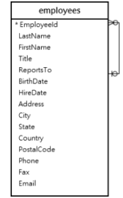

 <br />


* ### The ***employees*** table stores not only employee data but also organizational data. The ReportsTo column specifies the reporting relationship between employees.

* ### If an employee reports to a manager, the value of the ***ReportsTo*** column of the employee’s row is equal to the value of the ***EmployeeId*** column of the manager’s row. In case an employee does not report to anyone, the ***ReportsTo*** column is `NULL`.

- ### To get the information on who is the direct report of whom, you use the following statement:

```sql
SELECT m.firstname || ' ' || m.lastname AS 'Manager',
       e.firstname || ' ' || e.lastname AS 'Direct report' 
FROM employees e
INNER JOIN employees m ON m.employeeid = e.reportsto
ORDER BY manager;
```
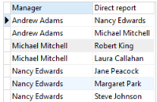

### -  The statement used the `INNER JOIN` clause to join the employees to itself. The employees table has two roles: employees and managers.

### - Because we used the `INNER JOIN` clause to join the employees table to itself, the result set does not have the row whose manager column contains a `NULL` value.

>> ### ___Note:___ that the concatenation operator `||` concatenates multiple strings into a single string. In the example, we use the concatenation operator to from the full names of the employees by concatenating the first name, space, and last name.

<br/>

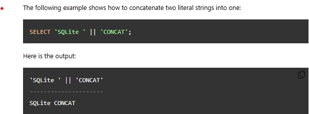

- ### In case you want to query the CEO who does not report to anyone, you need to change the `INNER JOIN` clause to `LEFT JOIN` clause in the query above.

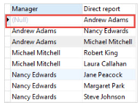

- ### ***Andrew Adams:*** is the CEO because he does not report anyone.

<br/>

+ ### You can use the self-join technique to find the employees located in the same city as the following query:

```sql
SELECT DISTINCT
	e1.city,
	e1.firstName || ' ' || e1.lastname AS fullname
FROM
	employees e1
INNER JOIN employees e2 ON e2.city = e1.city 
   AND (e1.firstname <> e2.firstname AND e1.lastname <> e2.lastname)
ORDER BY
	e1.city;
```
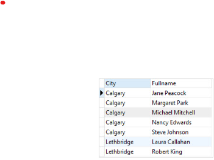

<br />

### - The join condition has two expressions:
* ### `e1.city = e2.city`: to make sure that both employees located in the same city.
* ### `e.firstname <> e2.firstname AND e1.lastname <> e2.lastname`: to ensure that `e1` and `e2` are not the same employee with the assumption that there aren’t employees who have the same first name and last name.

<be />

> 16. ##  **SQLite Full Outer Join:**
* ### is a combination of  a `LEFT JOIN` and a `RIGHT JOIN`. The result set of the full outer join has `NULL` values for every column of the table that does not have a matching row in the other table. For the matching rows, the `FULL OUTER JOIN` produces a single row with values from columns of the rows in both tables.

### - The following picture illustrates the result of the `FULL OUTER JOIN` clause:

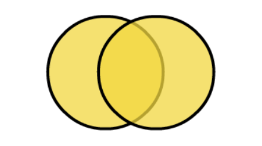

```sql
-- create and insert data into the dogs table
CREATE TABLE dogs (
    type       TEXT,
    color TEXT
);

INSERT INTO dogs(type, color) 
VALUES('Hunting','Black'), ('Guard','Brown');

-- create and insert data into the cats table
CREATE TABLE cats (
    type       TEXT,
    color TEXT
);

INSERT INTO cats(type,color) 
VALUES('Indoor','White'), 
      ('Outdoor','Black');
```

- ### The following statement uses the `FULL OUTER JOIN` clause to query data from the dogs and cats tables.

```sql
SELECT *
FROM dogs 
FULL OUTER JOIN cats
    ON dogs.color = cats.color;
```
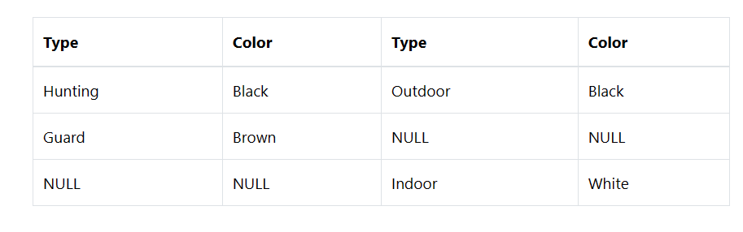

<br />

>> ___NOTE:___ SQLite does not support the `RIGHT JOIN` clause and also the `FULL OUTER JOIN` clause.

<br />

## - <ins>Emulating SQLite full outer join:
- ### The following statement emulates the FULL OUTER JOIN clause in SQLite:

```sql
SELECT d.type,
         d.color,
         c.type,
         c.color
FROM dogs d
LEFT JOIN cats c USING(color)
UNION ALL
SELECT d.type,
         d.color,
         c.type,
         c.color
FROM cats c
LEFT JOIN dogs d USING(color)
WHERE d.color IS NULL;
```
### - How the query works:
+ ### Because SQLilte does not support the `RIGHT JOIN` clause, we use the `LEFT JOIN` clause in the second `SELECT` statement instead and switch the positions of the cats and dogs tables.
+ ### The `UNION ALL` clause retains the duplicate rows from the result sets of both queries.
+ ### The `WHERE` clause in the second `SELECT` statement removes rows that already included in the result set of the first `SELECT` statement.

> 17. ## SQLite Group By:

- ### The `GROUP BY` clause is an optional clause of the `SELECT` statement. The `GROUP BY` clause a selected group of rows into summary rows by values of one or more columns.

- ### The `GROUP BY` clause returns one row for each group. For each group, you can apply an ***aggregate function*** such as `MIN, MAX, SUM, COUNT, or AVG` to provide more information about each group.

### - The illustrate of the SQLite GROUP BY clause.

```sql
SELECT 
    column_1,
    aggregate_function(column_2) 
FROM 
    table
GROUP BY 
    column_1,
    column_2;
```

* ## <ins>GROUP BY examples:
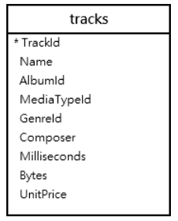

- ### <ins>GROUP BY clause with COUNT function:
###  The following statement returns the album id and the number of tracks per album. It uses the `GROUP BY` clause to groups tracks by album and applies the `COUNT()` function to each group.

```sql
SELECT
	albumid,
	COUNT(trackid)
FROM
	tracks
GROUP BY
	albumid;
```
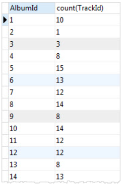

<br />

### - You can use the `ORDER BY` clause to sort the groups as follows:

```sql
SELECT
	albumid,
	COUNT(trackid)
FROM
	tracks
GROUP BY
	albumid
ORDER BY COUNT(trackid) DESC;
```

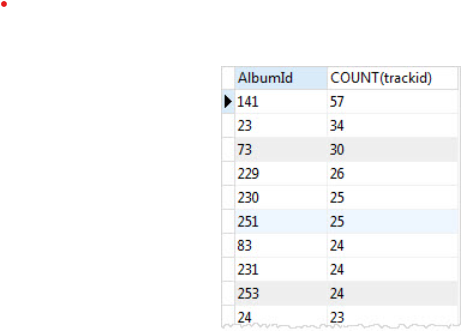

<br />

+ ### <ins>GROUP BY and INNER JOIN clause:
### You can query data from multiple tables using the `INNER JOIN` clause, then use the `GROUP BY` clause to group rows into a set of summary rows.
<br />

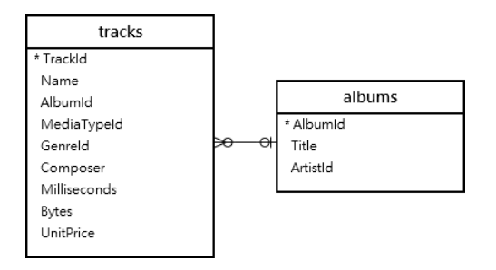

### - The following statement joins the tracks table with the albums table to get the album’s titles and uses the `GROUP BY` clause with the COUNT function to get the number of tracks per album.

```sql
SELECT
	tracks.albumid,
	title,
	COUNT(trackid)
FROM
	tracks
INNER JOIN albums ON albums.albumid = tracks.albumid
GROUP BY
	tracks.albumid;
```

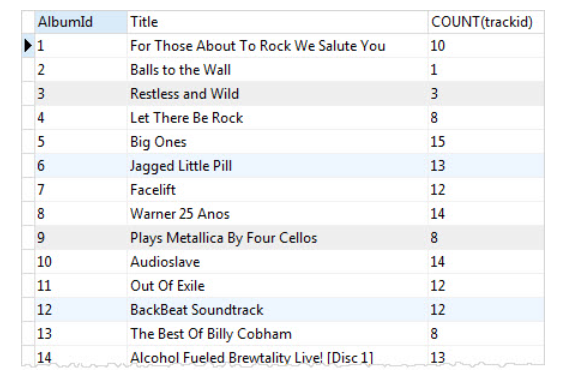

<br />

 ### -  <ins>GROUP BY with HAVING clause:
- ### To filter groups, you use the `GROUP BY & HAVING` clause. To get the albums that have more than 15 tracks, you use the following statement:

```sql
SELECT
	tracks.albumid,
	title,
	COUNT(trackid)
FROM
	tracks
INNER JOIN albums ON albums.albumid = tracks.albumid
GROUP BY
	tracks.albumid
HAVING COUNT(trackid) > 15;
```
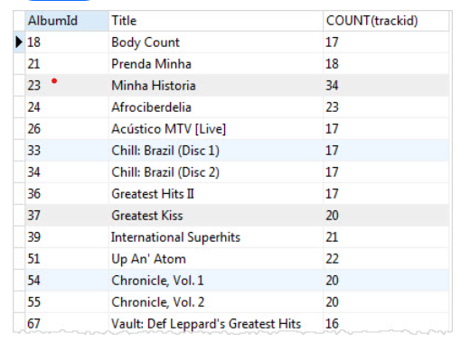

 ### - <ins>GROUP BY clause with SUM function example:
- ### You can use the `SUM` function to calculate total per group. To get total length and bytes for each album, you use the `SUM` function to calculate total milliseconds and bytes.

```sql
SELECT
	albumid,
	SUM(milliseconds) length,
	SUM(bytes) size
FROM
	tracks
GROUP BY
	albumid;
```
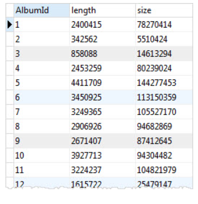

<br />

### -<ins>GROUP BY with MAX, MIN, and AVG functions:
- ### The following statement returns the album id, album title, maximum length, minimum length, and the average length of tracks in the tracks table.

```sql
SELECT
	tracks.albumid,
	title,
	min(milliseconds),
	max(milliseconds),
	round(avg(milliseconds),2)
FROM
	tracks
INNER JOIN albums ON albums.albumid = tracks.albumid
GROUP BY
	tracks.albumid;
```
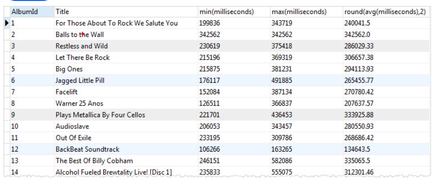

<br/>

### -<ins>GROUP BY multiple columns example:
- ### In the previous example, we have used one column in the `GROUP BY` clause. SQLite allows you to group rows by multiple columns.

### - to group tracks by media type and genre, you use the following statement:

```sql
SELECT
   MediaTypeId, 
   GenreId, 
   COUNT(TrackId)
FROM
   tracks
GROUP BY
   MediaTypeId, 
   GenreId;
```
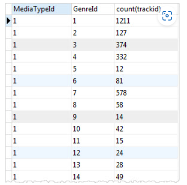

<br/>

### -<ins>GROUP BY date example:

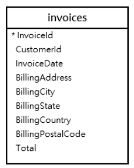

<br/>

### - The following statement returns the number of invoice by years.

```sql
SELECT
   STRFTIME('%Y', InvoiceDate) InvoiceYear, 
   COUNT(InvoiceId) InvoiceCount
FROM
   invoices
GROUP BY
   STRFTIME('%Y', InvoiceDate)
ORDER BY
   InvoiceYear;
```
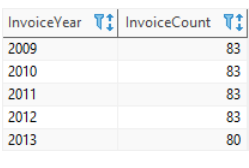

<br/>

### - In this example:

* ### The function `STRFTIME('%Y', InvoiceDate)` returns a year from a date string.
* ### The `GROUP BY` clause groups the invoices by years.
* ### The function `COUNT()` returns the number of invoice in each year.


----------------------------------------------

> 18. ## SQLite Having:
- ### is specifies a search condition for a group.
+ ###  useing the `HAVING` clause with the `GROUP BY` clause. The `GROUP BY` clause groups a set of rows into a set of summary rows or groups. Then the `HAVING` clause filters groups based on a specified condition.

>> ### * ___NOTE:___ that the `HAVING` clause is applied after `GROUP BY` clause, whereas the `WHERE` clause is applied before the `GROUP BY` clause. And use the `HAVING` clause, you must include the `GROUP BY` clause.

```sql
SELECT
	column_1, 
        column_2,
	aggregate_function (column_3)
FROM
	table
GROUP BY
	column_1,
        column_2
HAVING
	search_condition;
```

### - <ins> HAVING clause examples:

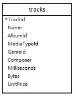

<br />

### - To find the number of tracks for each album, you use `GROUP BY` clause as follows:

```sql
SELECT
	albumid,
	COUNT(trackid)
FROM
	tracks
GROUP BY
	albumid;
```

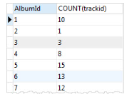

<br />

### - To find the numbers of tracks for the album with id 1, we add a ``HAVING`` clause to the following statement:

```sql
SELECT
	albumid,
	COUNT(trackid)
FROM
	tracks
GROUP BY
	albumid
HAVING albumid = 1;
```
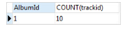

### - To find albums that have the number of tracks between 18 and 20, you use the aggregate function in the `HAVING` clause as shown in the following statement:

```sql
SELECT
   albumid,
   COUNT(trackid)
FROM
   tracks
GROUP BY
   albumid
HAVING 
   COUNT(albumid) BETWEEN 18 AND 20
ORDER BY albumid;
```
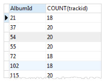

<br />

### -  <ins>HAVING clause with INNER JOIN example:

+ ### The following statement queries data from ***tracks*** and ***albums*** tables using `inner join` to find albums that have the total length greater than 60,000,000 milliseconds.

```sql
SELECT
	tracks.AlbumId,
	title,
	SUM(Milliseconds) AS length
FROM
	tracks
INNER JOIN albums ON albums.AlbumId = tracks.AlbumId
GROUP BY
	tracks.AlbumId 
HAVING
	length > 60000000;
```
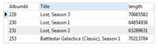

------------------

> 19. ## SQLite Union:
### - to combine data from multiple tables into a complete result set. It may be for tables with similar data within the same database or maybe you need to combine similar data from multiple databases. 

### - To combine rows from two or more queries into a single result set, you use SQLite `UNION` operator. The following illustrates the basic syntax of the `UNION` operator:

```bsah
query_1
UNION [ALL]
query_2
UNION [ALL]
query_3
...;
```

 - ### Both `UNION` and `UNION ALL` operators combine rows from result sets into a single result set. The `UNION` operator removes eliminate duplicate rows, whereas the `UNION ALL` operator does not.

- ### Because the `UNION ALL` operator does not remove duplicate rows, it runs faster than the `UNION` operator.

### - There are rules to union data:

+ ### The number of columns in all queries must be the same.
+ ### The corresponding columns must have compatible data types.
+ ### The column names of the first query determine the column names of the combined result set.
+ ### The `GROUP BY` and `HAVING` clauses are applied to each individual query, not the final result set.
+ ### `The ORDER BY clause is applied to the combined result set, not within the individual result set.`

>> ### ___Note:___ that the difference between `UNION` and `JOIN` e.g., `INNER JOIN` or `LEFT JOIN` is that the `JOIN` clause combines columns from multiple related tables, while `UNION` combines rows from multiple similar tables.

- ### Suppose we have two tables t1 and t2 with the following structures:

```sql
CREATE TABLE t1(
    v1 INT
);
 
INSERT INTO t1(v1)
VALUES(1),(2),(3);
 
CREATE TABLE t2(
    v2 INT
);
INSERT INTO t2(v2)
VALUES(2),(3),(4);
```

- ### The following statement combines the result sets of the t1 and t2 table using the `UNION` operator:

```sql
SELECT v1
  FROM t1
UNION
SELECT v2
  FROM t2;
```
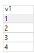

### - the illustrates for `UNION` operation of t1 and t2 tables:

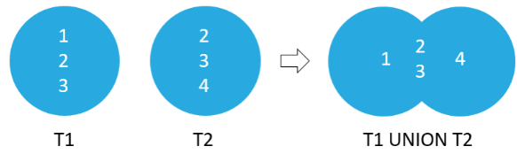

### - The following statement combines the result sets of `t1` and `t2` table using the  `UNION ALL` operator:

```sql
SELECT v1
  FROM t1
UNION ALL
SELECT v2
  FROM t2;
```
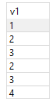

### - The following picture illustrates the `UNION ALL` operation of the result sets of ***t1*** and ***t2*** tables:

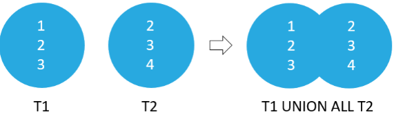

<br />

### <ins>1) SQLite UNION example:

* ### This statement uses the `UNION` operator to combine names of employees and customers into a single list:

```sql
SELECT FirstName, LastName, 'Employee' AS Type
FROM employees
UNION
SELECT FirstName, LastName, 'Customer'
FROM customers;
```
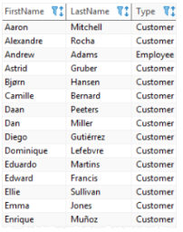

<br />


### <ins> 2)  UNION with ORDER BY example:

- ### This example uses the `UNION` operator to combine the names of the employees and customers into a single list. In addition, it uses the `ORDER BY` clause to sort the name list by first name and last name.

```sql
SELECT FirstName, LastName, 'Employee' AS Type
FROM employees
UNION
SELECT FirstName, LastName, 'Customer'
FROM customers
ORDER BY FirstName, LastName;
```
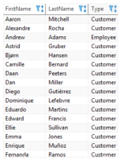

-----------

>  20. ## SQLite Except:

- ### compares the result sets of two queries and returns distinct rows from the left query that are not output by the right query.

```sql
SELECT select_list1
FROM table1
EXCEPT
SELECT select_list2
FROM table2
```

### - This query must conform to the following rules:

* ### First, the number of columns in the select lists of both queries must be the same.
- ### Second, the order of the columns and their types must be comparable.

<br />

### - The following statements create two tables ***t1*** and ***t2*** and insert some data into both tables:

```sql
CREATE TABLE t1(
    v1 INT
);

INSERT INTO t1(v1)
VALUES(1),(2),(3);

CREATE TABLE t2(
    v2 INT
);
INSERT INTO t2(v2)
VALUES(2),(3),(4);
```
<br />

### - The following statement illustrates how to use the `EXCEPT` operator to compare result sets of two queries:

```sql
SELECT v1
FROM t1
EXCEPT 
SELECT v2
FROM t2;
```

```
- The output is 1.
```

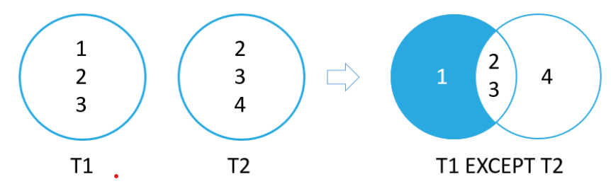

<br/>

## -  <ins>EXCEPT examples:

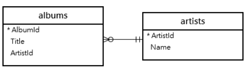

 <br />

- ### The following statement finds artist ids of artists who do not have any album in the ***albums*** table:

```sql
SELECT ArtistId
FROM artists
EXCEPT
SELECT ArtistId
FROM albums;
```
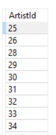

-------------------------------------
> 21.  ## SQLite Intersect:

### - compares the result sets of two queries and returns distinct rows that are output by both queries.

<br/>

- ### The following illustrates the syntax of the `INTERSECT` operator:

```sql
SELECT select_list1
FROM table1
INTERSECT
SELECT select_list2
FROM table2
```

 ### - The basic rules for combining the result sets of two queries are as follows:

+ ### First, the number and the order of the columns in all queries must be the same.
+ ### Second, the data types must be comparable.

<br/>

 ### - We will create two tables ***t1*** and ***t2*** and insert some data into both:

```sql
CREATE TABLE t1(
    v1 INT
);

INSERT INTO t1(v1)
VALUES(1),(2),(3);

CREATE TABLE t2(
    v2 INT
);
INSERT INTO t2(v2)
VALUES(2),(3),(4);
``` 

### - The following statement illustrates how to use the `INTERSECT` operator to compare result sets of two queries:

```sql
SELECT v1
FROM t1
INTERSECT
SELECT v2
FROM t2;
```

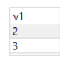

<br/>

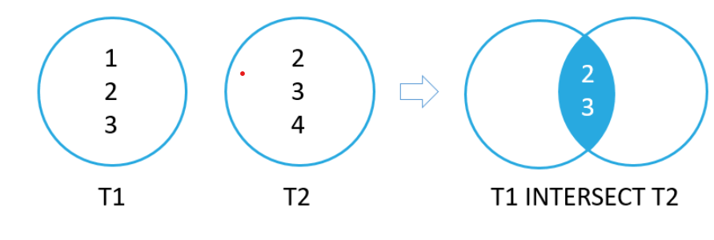

<br/>

## - <ins>INTERSECT example:

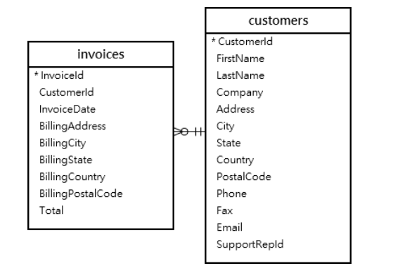

- ### The following statement finds customers who have invoices:

```sql
SELECT CustomerId
FROM customers
INTERSECT
SELECT CustomerId
FROM invoices
ORDER BY CustomerId;
```
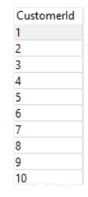
