- # **contents**:
* [What is SQLite](#What-is-SQLite) ✅
* [Download SQLite tools](#Download-SQLite-tools) ✅
* [Run SQLite tools](#Run-SQLite-tools) ✅
* [SQLite Commands](#SQLite-Commands) ✅

<br />

- # **SQLITE TUTORIAL:**
* [1. SQLite Select](#1-.-SQLite-Select) ✅
* [2. SQLite ORDER BY](#SQLite-ORDER-BY) ✅
* [3. SQLite SELECT DISTINCT](#SQLite-SELECT-DISTINCT) ✅
* [4. SQLite WHERE clause](#SQLite-WHERE-clause) ✅
* [5. SQLite LIMIT clause](#SQLite-LIMIT-clause) ✅
* [6. SQLite BETWEEN Operator](#SQLite-BETWEEN-Operator) ✅
* [7. SQLite IN operator](#SQLite-IN-operator) ✅
* [8. SQLite LIKE operator](#SQLite-LIKE-operator) ✅
* [9. SQLite IS NULL operator](#SQLite-IS-NULL-operator) ✅
* [10. SQLite GLOB operator](#SQLite-GLOB-operator) ✅
* [11. SQLite joins](#SQLite-joins) ✅
* [12. SQLite inner join clause](#SQLite-inner-join-clause) ✅
* [13. SQLite LEFT JOIN clause](#SQLite-LEFT-JOIN-clause) ✅
* [14. SQLite CROSS JOIN](#__SQLite-CROSS-JOIN__) ✅

<br/>

<br/>

#  **GETTING STARTED** :
### **What is SQLite** ?
#### `SQLite:` is a software library that provides a relational database management system. The lite in SQLite means lightweight in terms of setup, database administration, and required resources.

### Serverless
#### Normally, an RDBMS such as MySQL, PostgreSQL, etc., requires a separate server process to operate. The applications that want to access the database server use TCP/IP protocol to send and receive requests. This is called client/server architecture.

#### The following diagram illustrates the RDBMS client/server architecture:
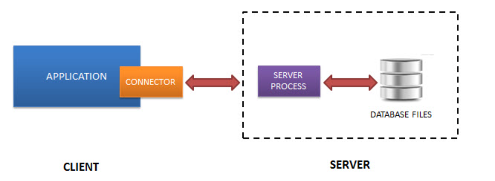

### - SQLite does NOT work this way.

### - SQLite does NOT require a server to run.

### - SQLite database is integrated with the application that accesses the database. The applications interact with the SQLite database read and write directly from the database files stored on disk.

### - The following diagram illustrates the SQLite server-less architecture:


### Download SQLite tools:
#### To download SQLite, you open the [download page](https://www.sqlite.org/download.html) of the SQlite official website.
- #### To work with SQLite on Windows, you download the command-line shell program as shown in the screenshot below.
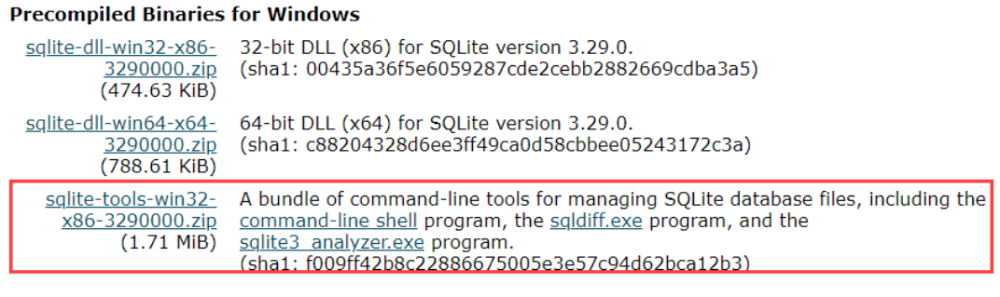

### Run SQLite tools:
#### Installing SQLite is simple and straightforward.

#### First, create a new folder e.g., `C:\sqlite`.
#### Second, extract the content of the file that you downloaded in the previous section to the C:\sqlite folder. You should see three programs in the `C:\sqlite` folder as shown below:
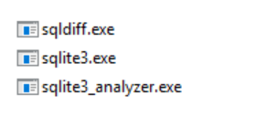

### 1. open the command line window:
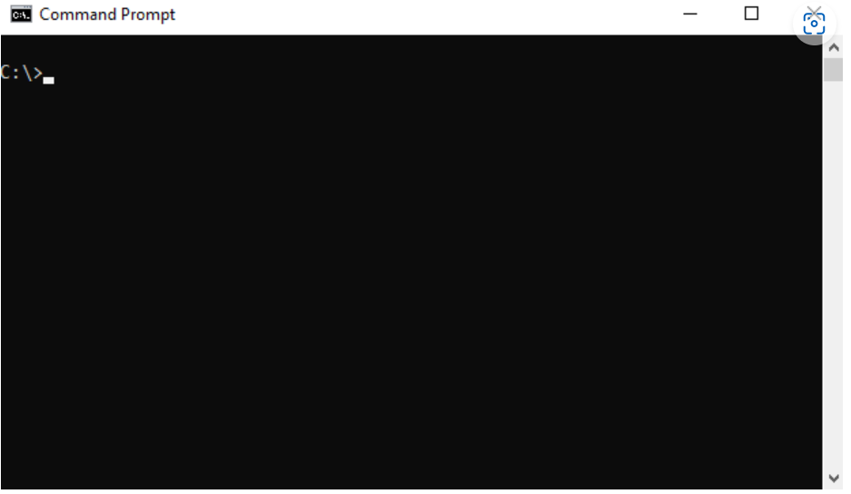

### 2. navigate to the `C:\sqlite` folder.
```js
C:\cd c:\sqlite
C:\sqlite>
```
### 3. type `sqlite3` and press enter, you should see the following output:
```js
C:\sqlite>sqlite3
SQLite version 3.29.0 2019-07-10 17:32:03
Enter ".help" for usage hints.
Connected to a transient in-memory database.
Use ".open FILENAME" to reopen on a persistent database.
sqlite>
```
### 4. to quit the sqlite>, you use  `.quit` command as follows:
```bsah
sqlite> .quit
```
## SQLite Commands:
* ### To start the sqlite3, you type the `sqlite3` as follows:
```js
>sqlite3
SQLite version 3.29.0 2019-07-10 17:32:03
Enter ".help" for usage hints.
Connected to a transient in-memory database.
Use ".open FILENAME" to reopen on a persistent database.
```

* ### To open a database file, you use the `.open FILENAME` command. The following statement opens the chinook.db database:
 ```js
sqlite> .open c:\sqlite\db\chinook.db
```

* ### Show tables in a database
#### To display all the tables in the current database, you use the `.tables` command. The following commands open a new database connection to the chinook database and display the tables in the database.
```js
>sqlite3 c:\sqlite\db\chinook.db
SQLite version 3.29.0 2019-07-10 17:32:03
Enter ".help" for usage hints.
sqlite> .tables
albums          employees       invoices        playlists
artists         genres          media_types     tracks
customers       invoice_items   playlist_track
sqlite>
```
* ### To exit the sqlite3 program, you use the `.exit` command.
```js
sqlite>.exit
```
* ### To find tables based on a specific pattern, you use the `.table` pattern command. The sqlite3 uses the `LIKE` operator for pattern matching.

### For example, the following statement returns the table that ends with the string `es`.
```js
sqlite> .table '%es'
employees    genres       invoices     media_types
sqlite>
```

* ### Show the structure of a table

### The following command shows the structure of the albums table.
```js
sqlite> .schema albums
CREATE TABLE "albums"
(
    [AlbumId] INTEGER PRIMARY KEY AUTOINCREMENT NOT NULL,
    [Title] NVARCHAR(160)  NOT NULL,
    [ArtistId] INTEGER  NOT NULL,
    FOREIGN KEY ([ArtistId]) REFERENCES "artists" ([ArtistId])
                ON DELETE NO ACTION ON UPDATE NO ACTION
);
CREATE INDEX [IFK_AlbumArtistId] ON "albums" ([ArtistId]);
sqlite>
```

* ### To show all indexes of the current database
```js
sqlite> .indexes
```

* ### To show the indexes of a specific table, you use the `.indexes TABLE` command. For example, to show indexes of the `albums` table, you use the following command:

```js
sqlite> .indexes albums
```

* ### Save the result of a query into a file:
   ###  To save the result of a query into a file, you use the `.output FILENAME` command. Once you issue the `.output` command, all the results of the subsequent queries will be saved to the file that you specified in the `FILENAME` argument. If you want to save the result of the next single query only to the file, you issue the `.once FILENAME` command.

   ### To display the result of the query to the standard output again, you issue the `.output` command without arguments.

    ### The following commands select the `title` from the `albums` table and write the result to the ``albums.txt` file.

```js
sqlite> .output albums.txt
sqlite> SELECT title FROM albums;
```

- ### Execute SQL statements from a file
  ### Suppose we have a file named `commands.txt` in the `c:\sqlite\` folder with the following content:

```js
SELECT albumid, title
FROM albums
ORDER BY title
LIMIT 10;
```
- ### To execute the SQL statements in the `commands.txt` file, you use the `.read FILENAME` command as follows:

```js
sqlite> .mode column
sqlite> .header on
sqlite> .read c:/sqlite/commands.txt
AlbumId     Title
----------  ----------------------
156         ...And Justice For All
257         20th Century Masters -
296         A Copland Celebration,
94          A Matter of Life and D
95          A Real Dead One
96          A Real Live One
285         A Soprano Inspired
139         A TempestadeTempestade
203         A-Sides
160         Ace Of Spades
```

## **SQLITE TUTORIAL**:

-----------------------------------

> 1. ### SQLite Select:

- ### Querying data from a table using the SELECT statement
  ### We often use the SELECT statement to query data from one or more table. The syntax of the SELECT statement is as follows:

```js
SELECT DISTINCT column_list
FROM table_list
  JOIN table ON join_condition
WHERE row_filter
ORDER BY column
LIMIT count OFFSET offset
GROUP BY column
HAVING group_filter;
```
- #### Use `SELECT` statement that allows you to query data from a single table.
- #### Use `ORDER` BY clause to sort the result set.
- #### Use `DISTINCT` clause to query unique rows in a table.
- #### Use `WHERE` clause to filter rows in the result set.
- #### Use `LIMIT OFFSET` clauses to constrain the number of rows returned.
- #### Use `INNER JOIN` or `LEFT JOIN` to query data from multiple tables using join.
- #### Use `GROUP BY` to get the group rows into groups and apply aggregate function for each group.
- #### Use `HAVING` clause to filter groups.

* ### To get data from the tracks table such as trackid, track name, composer, and unit price, you use the following statement:
```js
SELECT
	trackid,
	name,
	composer,
	unitprice
FROM
	tracks;
```

  ### SQLite returns the following result: 
  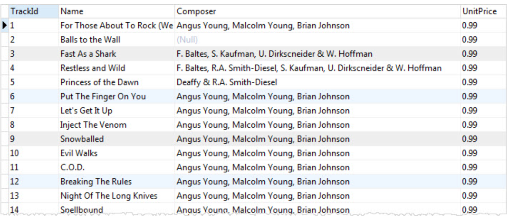

* ### To get data from all columns: 
```js
SELECT * FROM tracks;
```

> - ### NOTE: You should use the asterisk (*) for the testing purpose only, not in the real application development. Becaus When you develop an application, you should control what SQLite returns to your application. Suppose, a table has 3 columns, and you use the asterisk (*) to retrieve the data from all three columns. What if someone removes a column, your application would not be working properly, because it assumes that there are three columns returned and the logic to process those three columns would be broken.

-----------------------------------------------------------
> 2. ### SQLite ORDER BY:
#### If you use the  `SELECT` statement to query data from a table, the order of rows in the result set is unspecified.

#### To sort the result set, you add the `ORDER BY` clause to the  SELECT statement as follows:

```js
SELECT
   select_list
FROM
   table
ORDER BY
    column_1 ASC,
    column_2 DESC;
```

* ### The `ASC` keyword means ascending.
* ### And the `DESC` keyword means descending.
- ### Suppose, you want to get data from ***name***, ***milliseconds***, and ***album id*** columns and you want to sort the sorted result (by ***AlbumId***) above by the ***Milliseconds*** column in descending order. In this case, you need to add the ***Milliseconds*** column to the `ORDER BY` clause as follows:, you use the following statement:
```js
SELECT
	name,
	milliseconds, 
	albumid
FROM
	tracks
ORDER BY
	albumid ASC,
        milliseconds DESC;
```
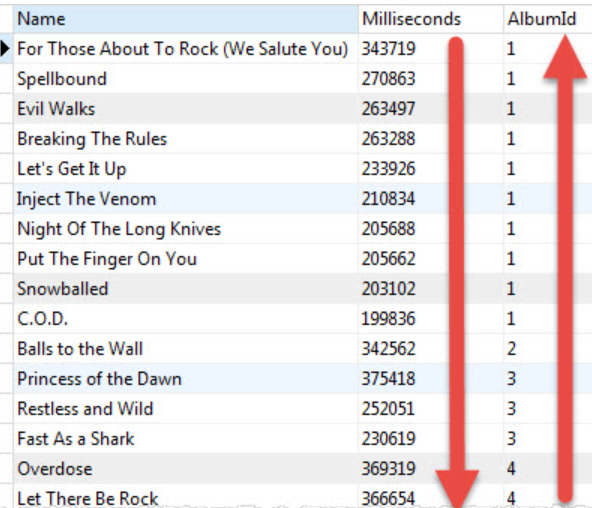

* ### **Sorting NULLs:**
#### In the database world, NULL is special. It denotes that the information missing or the data is not applicable.

> ***NOTE***: SQLite 3.30.0 added the `NULLS FIRST` and `NULLS LAST` options to the ORDER BY clause. The `NULLS FIRST` option specifies that the NULLs will appear at the beginning of the result set while the `NULLS LAST` option place NULLs at the end of the result set.

- ### The following example uses the `NULLS LAST` option to place ***NULLs*** after other values:

```js
SELECT 
    TrackId, 
    Name, 
    Composer 
FROM 
    tracks
ORDER BY 
    Composer NULLS LAST;
```
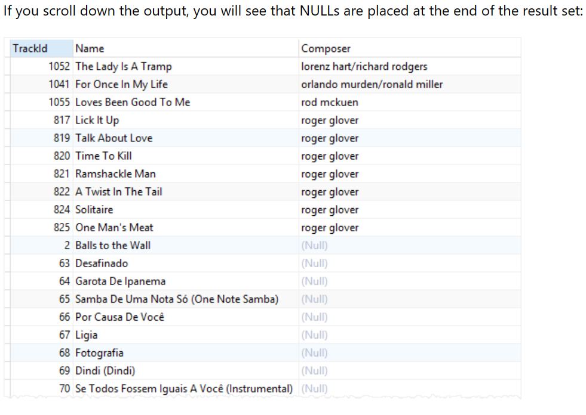

> 3. ### SQLite SELECT DISTINCT:
 #### The `DISTINCT` clause is an optional clause of the  `SELECT` statement. The `DISTINCT` clause allows you to remove the duplicate rows in the result set.

 * #### The syntax of the `DISTINCT` clause:
```js
SELECT DISTINCT	select_list
FROM table;
```

- ### Suppose you want to know the cities where the customers locate, you can use the `SELECT` statement to get data from the ***city*** column of the ***customers*** table as follows:

```js
SELECT city
FROM customers
ORDER BY city;
```
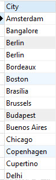

- ### It returns 59 rows. There are few duplicate rows such as ***Berlin ,London*** and ***Mountain View***. To remove these duplicate rows, you use the `DISTINCT` clause as follows:
```js
SELECT DISTINCT city
FROM customers
ORDER BY city;
```
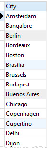

> ###  ***NOTE**: if i select a list of columns from a table and want to get a unique combination of some columns, i can use the `GROUP BY` clause.

-----------------------------------------------------------

> 4. ###  SQLite WHERE clause: 
#### The `WHERE` clause is an optional clause of the `SELECT` statement. It appears after the `FROM` clause as the following statement:

```js
SELECT
	column_list
FROM
	table
WHERE
	search_condition;
```
- #### SQLite uses the following steps:

- ####  First, check the table in the `FROM` clause.
- #### Second, evaluate the conditions in the `WHERE` clause to get the rows that met these conditions.
- ### Third, make the final result set based on the rows in the previous step with columns in the `SELECT` clause.
### The search condition in the `WHERE` has the following form:
```js
left_expression COMPARISON_OPERATOR right_expression
```

## + **SQLite comparison operators**:
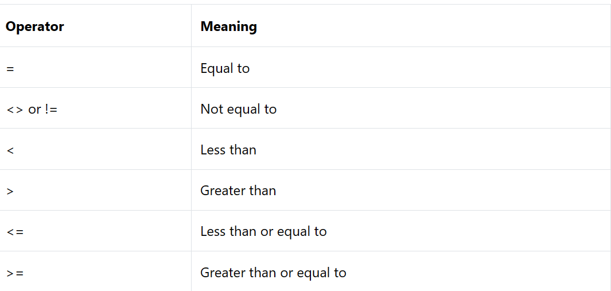

## + **SQLite logical operators**:
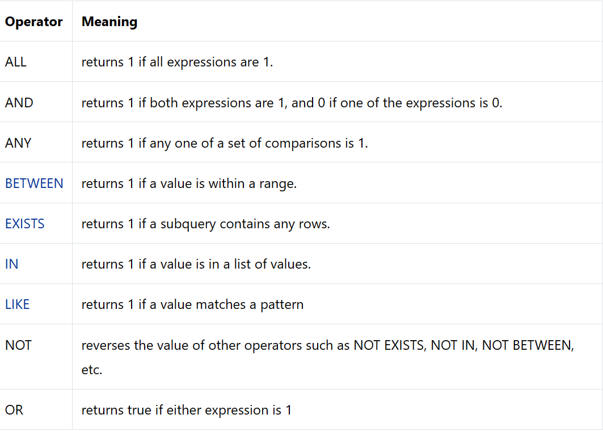

- ### The equality operator (`=`) is the most commonly used operator. For example, the following query uses the `WHERE` clause the equality operator to find all the tracks in the album id 1:

```js
SELECT
   name,
   milliseconds,
   bytes,
   albumid
FROM
   tracks
WHERE
   albumid = 1;
```
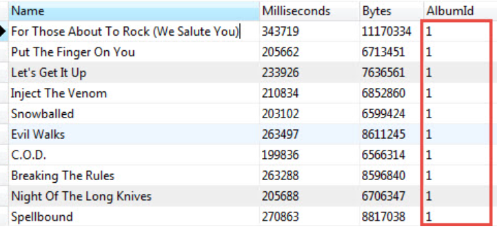

- ### I can use the logical operator to combine expressions. For example, to get tracks of the album 1 that have the length greater than 200,000 milliseconds, i use the following statement:

```js
SELECT
	name,
	milliseconds,
	bytes,
	albumid
FROM
	tracks
WHERE
	albumid = 1
AND milliseconds > 250000;
```
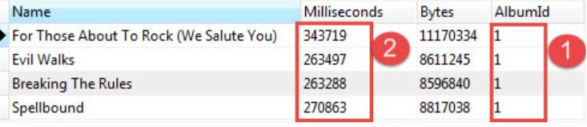

> ### SQLite WHERE clause with LIKE operator:
### Sometimes, you may not remember exactly the data that you want to search. In this case, you perform an inexact search using the `LIKE` operator.

### For example, to find which tracks composed by Smith, you use the LIKE operator as follows:

```js
SELECT
	name,
	albumid,
	composer
FROM
	tracks
WHERE
	composer LIKE '%Smith%'
ORDER BY
	albumid;
```
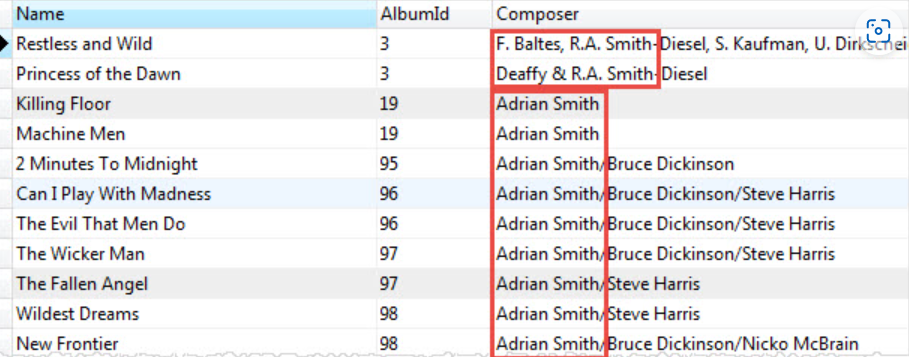

> ### SQLite WHERE clause with the IN operator:
The `IN` operator allows you to check whether a value is in a list of a comma-separated list of values. For example, to find tracks that have media type id is 2 or 3, you use the `IN` operator as shown in the following statement:

```js
SELECT
	name,
	albumid,
	mediatypeid
FROM
	tracks
WHERE
	mediatypeid IN (2, 3);
```
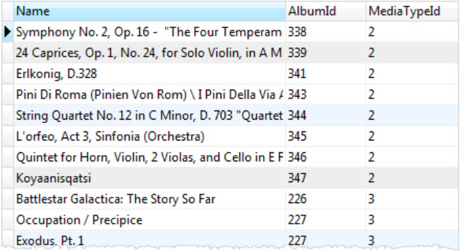

-----------------------------------------------------------

> 5. ###  SQLite LIMIT clause:
### use the `LIMIT` clause to constrain the number of rows returned by the query.
```js
SELECT
	column_list
FROM
	table
LIMIT row_count;
```
### For example, to get the first 10 rows in the ***tracks*** table, you use the following statement:

```js
SELECT
	trackId,
	name
FROM
	tracks
LIMIT 10;
```
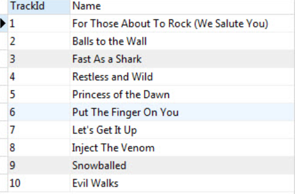

### to get the first 10 rows starting from the 10th row of the result set, you use `LIMIT OFFSET` keyword as the following:
```js
SELECT
	column_list
FROM
	table
LIMIT offset, row_count;
```
### For example, to get 10 rows starting from the 11th row in the tracks table, you use the following statement:

```js
SELECT
	trackId,
	name
FROM
	tracks
LIMIT 10 OFFSET 10;
```

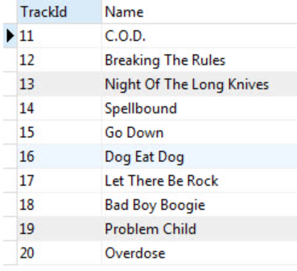
> ### LIMIT and ORDER BY clause:
-----------------------------------------------
>### ***NOTE:*** I should always use the `LIMIT` clause with the  `ORDER BY` clause. Because i want to get a number of rows in a specified order, not in an unspecified order.

```js
SELECT
   column_list
FROM
   table
ORDER BY column_1
LIMIT row_count;
```
### to get the top 10 biggest tracks by size, you use the following query:
```js
SELECT
	trackid,
	name,
	bytes
FROM
	tracks
ORDER BY
	bytes DESC
LIMIT 10;
```
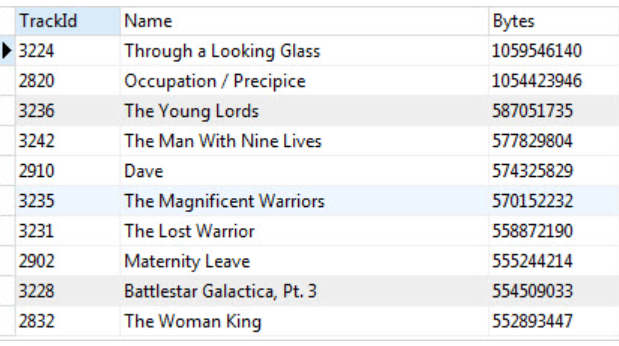

### To get the 5 shortest tracks, you sort the tracks by the length specified by milliseconds column using `ORDER BY` clause and get the first 5 rows using LIMIT clause.

```js
SELECT
	trackid,
	name,
	milliseconds
FROM
	tracks
ORDER BY
	milliseconds ASC
LIMIT 5;
```
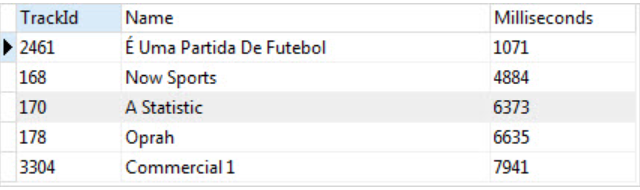

### Getting the nth highest and the lowest value:
### You can use the `ORDER BY` and `LIMIT` clauses to get the nth highest or lowest value rows.
### you use the following steps:

### - First, use `ORDER BY` to sort the result set in ascending order in case you want to get the nth lowest value, or descending order if you want to get the nth highest value.
### - Second, use the `LIMIT` OFFSET clause to get the nth highest or the nth lowest row.
### The following statement returns the second-longest track in the tracks table.
```js
SELECT
	trackid,
	name,
	milliseconds
FROM
	tracks
ORDER BY
	milliseconds DESC
LIMIT 1 OFFSET 1;
```
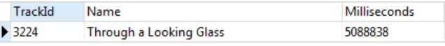

### The following statement gets the third smallest track on the tracks table.

```js
SELECT
	trackid,
	name,
	bytes
FROM
	tracks
ORDER BY
	bytes
LIMIT 1 OFFSET 2;
```
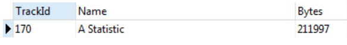

-----------------------------------

> 6. ###  SQLite BETWEEN Operator:
### The `BETWEEN` operator is a logical operator that tests whether a value is in range of values. If the value is in the specified range, the `BETWEEN` operator returns true. The `BETWEEN` operator can be used in the `WHERE` clause of the `SELECT`, `DELETE`, `UPDATE`, and `REPLACE` statements.

### The following illustrates the syntax of the SQLite BETWEEN operator:

```js
test_expression BETWEEN low_expression AND high_expression
```

### To negate the result of the BETWEEN operator, you use the NOT BETWEEN operator as follows:

```js
test_expression NOT BETWEEN low_expression AND high_expression
```
### * The following statement finds invoices whose total is between 14.96 and 18.86:

```js
SELECT
    InvoiceId,
    BillingAddress,
    Total
FROM
    invoices
WHERE
    Total BETWEEN 14.91 and 18.86    
ORDER BY
    Total; 
```
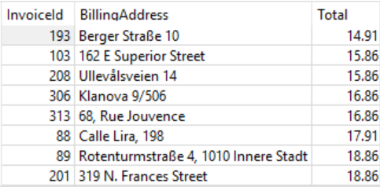

### - To find the invoices whose total are not between 1 and 20, you use the NOT BETWEEN operator as shown in the following query:

```js
SELECT
    InvoiceId,
    BillingAddress,
    Total
FROM
    invoices
WHERE
    Total NOT BETWEEN 1 and 20
ORDER BY
    Total;    
```
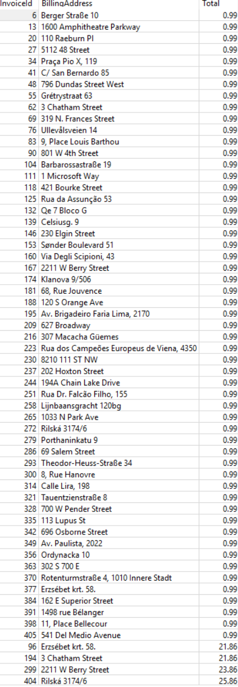

> ###  SQLite BETWEEN dates example:

- ### The following example finds invoices whose invoice dates are from January 1 2010 and January 31 2010:

```js
SELECT
    InvoiceId,
    BillingAddress,
    InvoiceDate,
    Total
FROM
    invoices
WHERE
    InvoiceDate BETWEEN '2010-01-01' AND '2010-01-31'
ORDER BY
    InvoiceDate;    
```
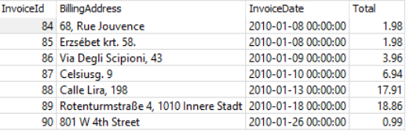

> ### SQLite NOT BETWEEN dates example:
### - The following statement finds invoices whose dates are not between January 03, 2009, and December 01, 2013:

```js
SELECT
    InvoiceId,
    BillingAddress,
    date(InvoiceDate) InvoiceDate,
    Total
FROM
    invoices
WHERE
    InvoiceDate NOT BETWEEN '2009-01-03' AND '2013-12-01'
ORDER BY
    InvoiceDate;
```
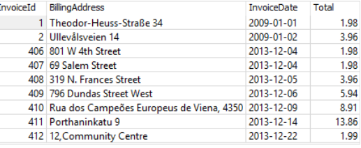

------------------------------

> 7. ###  SQLite IN operator:

 ### The SQLite IN operator determines whether a value matches any value in a list or a subquery.

* ###  The following statement uses the IN operator to query the tracks whose media type id is 1 or 2.

```js 
SELECT
	TrackId,
	Name,
	Mediatypeid
FROM
	Tracks
WHERE
	MediaTypeId IN (1, 2)
ORDER BY
	Name ASC;
```
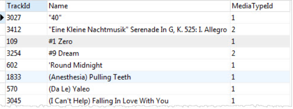

- ### IN operator with a subquery example:
### The following query returns a list of album id of the artist id 12:

```js
SELECT albumid
FROM albums
WHERE artistid = 12;
```
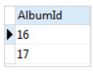

- ### To get the tracks that belong to the artist id 12, you can combine the `IN` operator with a subquery as follows:

```js
SELECT
	TrackId, 
	Name, 
	AlbumId
FROM
	Tracks
WHERE
	AlbumId IN (
		SELECT
			AlbumId
		FROM
			Albums
		WHERE
			ArtistId = 12
	);
```
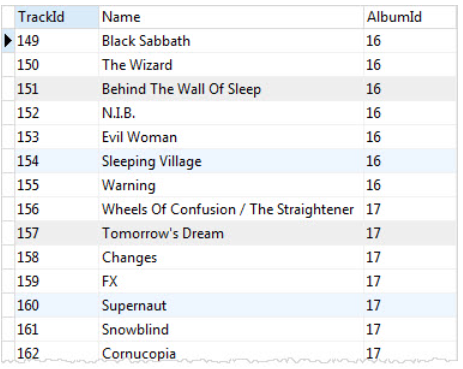

### In this example:

* ### First, the subquery returns a list of album ids that belong to the artist id 12.
* ### Then, the outer query return all tracks whose album id matches with the album id list returned by the subquery.

### - The following statement returns a list of tracks whose genre id is not in a list of (1,2,3).

```js
SELECT
	trackid,
	name,
	genreid
FROM
	tracks
WHERE
	genreid NOT IN (1, 2,3);
```
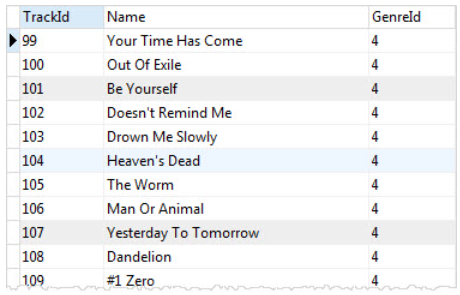

---------------------------------------------

> 8. ###  SQLite LIKE operator:

* ###  To query data based on partial information, you use the `LIKE` operator in the `WHERE` clause of the `SELECT` statement as follows:

```sql
SELECT
	column_list
FROM
	table_name
WHERE
	column_1 LIKE pattern;
```

> ### ***Note:*** that you can also use the `LIKE` operator in the `WHERE` clause of other statements such as the `DELETE` and `UPDATE`.

- ### SQLite provides two wildcards for constructing patterns. They are percent sign `%` and underscore `_` :

 * ### The percent sign `%` wildcard matches any sequence of zero or more characters.
* ### The underscore `_` wildcard matches any single character.
### -  The percent sign % wildcard examples:
* ### The `s%` pattern that uses the percent sign wildcard ( %) matches any string that starts with s e.g.,son and so.

* ### The %er pattern matches any string that ends with er like peter, clever, etc.

* ### And the %per% pattern matches any string that contains per such as percent and peeper.

### - The underscore _ wildcard examples:
* ### The `h_nt` pattern matches hunt, hint, etc. The __pple pattern matches topple, supple, tipple, etc.

> ### ***Note:*** that SQLite `LIKE` operator is case-insensitive. It means "A" LIKE "a" is true.

> - ### However, for Unicode characters that are not in the ASCII ranges, the LIKE operator is case sensitive e.g., "Ä" LIKE "ä" is false.

* ### To find the tracks whose names start with the `Wild` literal string, you use the percent sign `%` wildcard at the end of the pattern.

```sql
SELECT
	trackid,
	name	
FROM
	tracks
WHERE
	name LIKE 'Wild%'
```
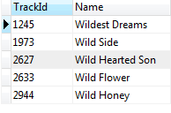

* ### To find the tracks whose names end with Wild word, you use % wildcard at the beginning of the pattern.

```sql
SELECT
	trackid,
	name
FROM
	tracks
WHERE
	name LIKE '%Wild'
```
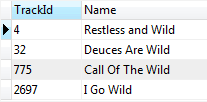

* ### To find the tracks whose names contain the Wild literal string, you use `%` wildcard at the beginning and end of the pattern:

```sql
SELECT
	trackid,
	name	
FROM
	tracks
WHERE
	name LIKE '%Wild%';
```
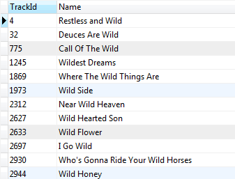

> ### LIKE with ESCAPE clause:
### If the pattern that you want to match contains `%` or `_` , you must use an escape character in an optional `ESCAPE` clause as follows:

```sql
column_1 LIKE pattern ESCAPE expression;
```
-  ### First, create a table t that has one column:

```sql
CREATE TABLE t(
	c TEXT
);
```
- ### Next, insert some rows into the table t:

```sql
INSERT INTO t(c)
VALUES('10% increase'),
	('10 times decrease'),
	('100% vs. last year'),
	('20% increase next year');
```
* ### Then, query data from the t table:

```sql
SELECT * FROM t;
```
```bash
c                     
----------------------
10% increase          
10 times decrease     
100% vs. last year    
20% increase next year
```

* ### Fourth, attempt to find the row whose value in the c column contains the 10% literal string:

```sql
SELECT c 
FROM t 
WHERE c LIKE '%10%%';
```
* ### However, it returns rows whose values in the c column contains 10:

```
c                 
------------------
10% increase      
10 times decrease 
100% vs. last year
```

* ### Fifth, to get the correct result, you use the ESCAPE clause as shown in the following query:

```sql
SELECT c 
FROM t 
WHERE c LIKE '%10\%%' ESCAPE '\';
```

* ### Here is the result set:

```
c           
------------
10% increase
```
----------------------

> 9. ###  SQLite IS NULL operator:
* ### `NULL` is special. It indicates that a piece of information is unknown or not applicable.

### The following statement attempts to find tracks whose composers are NULL:

```sql
SELECT
    Name, 
    Composer
FROM
    tracks
WHERE
    Composer = NULL;
```
* ### It returns an empty row without issuing any additional message.

### - To find all tracks whose composers are unknown, you use the IS NULL operator as shown in the following query:

```sql
SELECT
    Name, 
    Composer
FROM
    tracks
WHERE
    Composer IS NULL
ORDER BY 
    Name;
```   
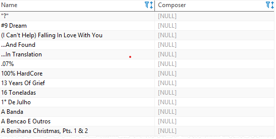

> ### SQLite IS NOT NULL operator:
### The NOT operator negates the IS NULL operator as follows:

```
expression | column IS NOT NULL
```

* ### The following example finds tracks whose composers are not NULL:

```sql
SELECT
    Name, 
    Composer
FROM
    tracks
WHERE
    Composer IS NOT NULL
ORDER BY 
    Name;     
```
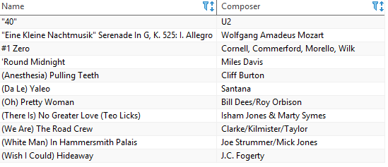

>  10. ###  SQLite GLOB operator:

- ### The `GLOB` operator is similar to the `LIKE` operator. The `GLOB` operator determines whether a string matches a specific pattern.

>> ###  ***NOTE:*** the `GLOB` patterns do not have escape characters.

### - The following shows the wildcards used with the `GLOB`  operator:

* ### The asterisk (`*`) wildcard matches any number of characters.
* ### The question mark (`?`) wildcard matches exactly one character.
<br />

### The following statement finds tracks whose names start with the string *Man*.
### The pattern *Man** matches any string that starts with Man.

```sql 
SELECT
	trackid,
	name
FROM
	tracks
WHERE
	name GLOB 'Man*';
```
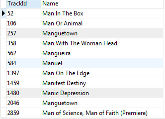

<br />

- ## The following statement gets the tracks whose names end with `Man`. The pattern `*Man` matches any string that ends with Man.

```sql
SELECT
	trackid,
	name
FROM
	tracks
WHERE
	name GLOB '*Man';
```
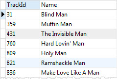
<br />

* ### The following query finds the tracks whose names start with any single character (`?`), followed by the string `ere` and then any number of character (`*`).

```sql
SELECT
	trackid,
	name
FROM
	tracks
WHERE
	name GLOB '?ere*';
```


<br/>

* ### To find the tracks whose names contain numbers, you can use the list wildcard `[0-9]` as follows:

```sql
SELECT
	trackid,
	name
FROM
	tracks
WHERE
	name GLOB '*[1-9]*';
```
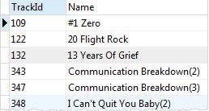

<br/>

* ### to find the tracks whose name does not contain any number, you place the character `^` at the beginning of the list:

```sql
SELECT
	trackid,
	name
FROM
	tracks
WHERE
	name GLOB '*[^1-9]*';
```
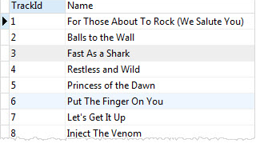

<br/>

+ ### The following statement finds the tracks whose names end with a number.

```sql
SELECT
	trackid,
	name
FROM
	tracks
WHERE
	name GLOB '*[1-9]';
```
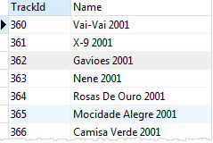

<br/>

> 11. ###  SQLite joins: 
### To query data from two or more tables.
### Example: I will use the *artists* and *albums* tables:

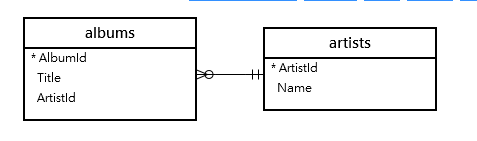

+ ### To query data from both *artists* and *albums* tables, you use can use an `INNER JOIN`, `LEFT JOIN`, or `CROSS JOIN` clause. Each join clause determines how SQLite uses data from one table to match with rows in another table.

>>  ### ***Note:*** that SQLite doesn’t directly support the `RIGHT JOIN` and `FULL OUTER JOIN`.

<br/>

> ### SQLite INNER JOIN: 
- ### The following statement returns the album titles and their artist names:

```sql
SELECT 
    Title,
    Name
FROM 
    albums
INNER JOIN artists 
    ON artists.ArtistId = albums.ArtistId;
```
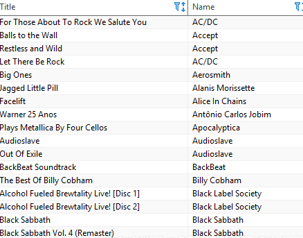

### In this example, the `INNER JOIN` clause matches each row from the albums table with every row from the *artists* table based on the join condition `(artists.ArtistId = albums.ArtistId)` specified after the `ON` keyword.

### If the join condition evaluates to true (or 1), the columns of rows from both *albums* and *artists* tables are included in the result set.

### This query uses table aliases (`l` for the albums table and `r` for artists table) to shorten the query:

```sql
SELECT
    l.Title, 
    r.Name
FROM
    albums l
INNER JOIN artists r ON
    r.ArtistId = l.ArtistId;
```

<br />

> ### SQLite LEFT JOIN:
### This statement selects the artist names and album titles from the artists and albums tables using the LEFT JOIN clause:

```sql
SELECT
    Name, 
    Title
FROM
    artists
LEFT JOIN albums ON
    artists.ArtistId = albums.ArtistId
ORDER BY Name;
```
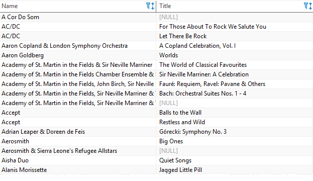

### The `LEFT JOIN` clause selects data starting from the left table (*artists*) and matching rows in the right table (*albums*) based on the join condition (*artists.ArtistId = albums.ArtistId*) .

- ### The left join returns all rows from the artists table (or left table) and the matching rows from the albums table (or right table).

- ### If a row from the left table doesn’t have a matching row in the right table, SQLite includes columns of the rows in the left table and NULL for the columns of the right table.

<br/>

> ### SQLite CROSS JOIN:

- ### The `CROSS JOIN` clause creates a Cartesian product of rows from the joined tables.

- ### Unlike the `INNER JOIN` and `LEFT JOIN` clauses, a `CROSS JOIN` doesn’t have a join condition. Here is the basic syntax of the CROSS JOIN clause:

```sql
SELECT
    select_list
FROM table1
CROSS JOIN table2;
```
>> ### **NOTE:** If the first table has N rows, the second table has M rows, the final result will have NxM rows.

<br/>

### - The following script creates the products and calendars tables:

```sql
CREATE TABLE products(
    product text NOT null
);

INSERT INTO products(product)
VALUES('P1'),('P2'),('P3');


CREATE TABLE calendars(
    y int NOT NULL,
    m int NOT NULL
);

INSERT INTO calendars(y,m)
VALUES 
    (2019,1),
    (2019,2),
    (2019,3),
    (2019,4),
    (2019,5),
    (2019,6),
    (2019,7),
    (2019,8),
    (2019,9),
    (2019,10),
    (2019,11),
    (2019,12);
```

* ### This query uses the `CROSS JOIN` clause to combine the *products* with the *months*:

```sql
SELECT * 
FROM products
CROSS JOIN calendars;
```
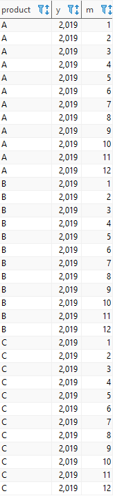

-----------------------------------

> 12.  ###  SQLite inner join clause:
### To query data from multiple tables, you use `INNER JOIN` clause. The `INNER JOIN` clause combines columns from correlated tables.

<br />

### Suppose you have two tables: A and B.
<br />

### A has a1, a2, and f columns. B has b1, b2, and f column. The A table links to the B table using a foreign key column named f.

```sql
SELECT a1, a2, b1, b2
FROM A
INNER JOIN B on B.f = A.f;
```
<br/>

* ### For each row in the ***A*** table, the `INNER JOIN` clause compares the value of the ***f*** column with the value of the ***f*** column in the ***B*** table. If the value of the ***f*** column in the ***A*** table equals the value of the ***f*** column in the ***B*** table, it combines data from ***a1, a2, b1, b2***, columns and includes this row in the result set.

<br/>

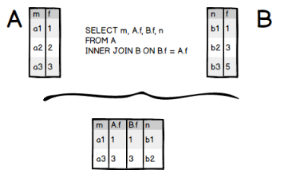

* ### Only the rows in the A table: (a1,1), (a3,3) have the corresponding rows in the B table (b1,1), (b2,3) are included in the result set.

<br/>

- ### The following diagram illustrates the `INNER JOIN` clause:
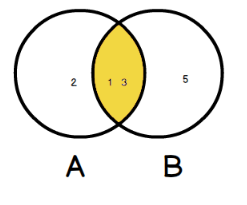

<br/>

- ### Let’s take a look at the ***tracks*** and ***albums*** tables in the sample database. The tracks table links to the ***albums** table via ***AlbumId*** column.

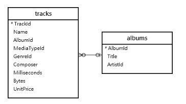

###  - In the tracks table, the ***AlbumId*** column is a `foreign` key. And in the ***albums*** table, the ***AlbumId*** is the `primary` key.
<br />

* ### To query data from both ***tracks*** and ***albums*** tables, you use the following statement:

```sql
SELECT
	trackid,
	name,
	title
FROM
	tracks
INNER JOIN albums ON albums.albumid = tracks.albumid;
```
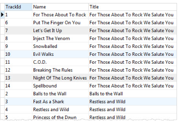

<br />

> ###  `inner join`: 3 tables example:

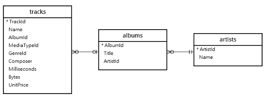

<br />

* ### To query data from these tables, you need to use two `inner join` clauses in the SELECT statement as follows:

```sql
SELECT
    trackid,
    tracks.name AS track,
    albums.title AS album,
    artists.name AS artist
FROM
    tracks
    INNER JOIN albums ON albums.albumid = tracks.albumid
    INNER JOIN artists ON artists.artistid = albums.artistid;
```

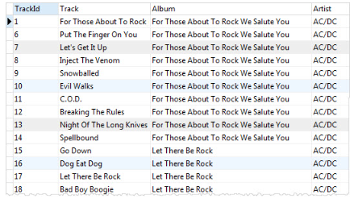

<br />

### - I can use a `WHERE` clause to get the ***tracks*** and ***albums*** of the ***artist*** with ***id*** 10 as the following statement:

```sql
SELECT
	trackid,
	tracks.name AS Track,
	albums.title AS Album,
	artists.name AS Artist
FROM
	tracks
INNER JOIN albums ON albums.albumid = tracks.albumid
INNER JOIN artists ON artists.artistid = albums.artistid
WHERE
	artists.artistid = 10;
```


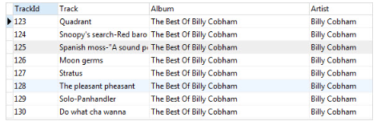

<br/>

-----------------------------------

> 13. ### SQLite LEFT JOIN clause:  
### to query data from multiple tables. 

* ### Similar to the INNER JOIN clause, the LEFT JOIN clause is an optional clause of the SELECT statement. You use the LEFT JOIN clause to query data from multiple related tables.

### - Suppose we have two tables: A and B.

* ### A has m and f columns.
* ### B has n and f columns.
### - To perform join between A and B using LEFT JOIN clause, you use the following statement:

```sql
SELECT
	a,
	b
FROM
	A
LEFT JOIN B ON A.f = B.f
WHERE search_condition;
```


- ### The expression `A.f = B.f` is a conditional expression. Besides the equality (=) operator, you can use other comparison operators such as greater than (>), less than (<), etc.

- ### The statement returns a result set that includes:

### - Rows in table A (left table) that have corresponding rows in table B.
### -Rows in the table A table and the rows in the table B filled with NULL values in case the row from table A does not have any corresponding rows in table B.


- ### In case you have a `WHERE` clause in the statement, the search_condition in the `WHERE` clause is applied after the matching of the LEFT JOIN clause completes.


- ### All rows in the table A are included in the result set.

- ### Because the second row (a2,2) does not have a corresponding row in table B, the LEFT JOIN clause creates a fake row filled with NULL.

- ### The following Venn Diagram illustrates the LEFT JOIN clause.


> ### LEFT JOIN examples:


<br />

- ### To find artists who do not have any albums by using the LEFT JOIN clause, we select artists and their corresponding albums. If an artist does not have any albums, the value of the AlbumId column is NULL.

### - To display the artists who do not have any albums first, we have two choices:

- ### First, use `ORDER BY` clause to list the rows whose AlbumId is `NULL` values first.
- ### Second, use `WHERE` clause and `IS NULL` operator to list only artists who do not have any albums.

- ### The following statement uses the `LEFT JOIN` clause with the `ORDER BY` clause.

```sql
SELECT
   artists.ArtistId, 
   AlbumId
FROM
   artists
LEFT JOIN albums ON
   albums.ArtistId = artists.ArtistId
ORDER BY
   AlbumId;
```
<br />

- ### The following statement uses the `LEFT JOIN` clause with the `WHERE` clause.

```sql
SELECT
   artists.ArtistId
   , AlbumId
FROM
   artists
LEFT JOIN albums ON
   albums.ArtistId = artists.ArtistId
WHERE
   AlbumId IS NULL;
```

<br />

-----------------------------------

> 14. ### SQLite CROSS JOIN: 
### to combine two or more result sets from multiple tables.

* ### If you use a `LEFT JOIN`, `INNER JOIN`, or `CROSS JOIN` without the `ON` or `USING` clause, SQLite produces the Cartesian product of the involved tables. The number of rows in the Cartesian product is the product of the number of rows in each involved tables.

### - Suppose, we have two tables A and B. The following statements perform the cross join and produce a cartesian product of the rows from the A and B tables.

```sql
SELECT *
FROM A JOIN B;
```
```sql
SELECT *
FROM A
INNER JOIN B;
```
```sql
SELECT *
FROM A
CROSS JOIN B;
```
```sql
SELECT * 
FROM A, B;
```

* ### Suppose, the ***A*** table has ___N___ rows and ___B___ table has ***M*** rows, the `CROSS JOIN` of these two tables will produce a result set that contains *NxM* rows.

* ### Imagine that if you have the third table ***C*** with ***K*** rows, the result of the `CROSS JOIN` clause of these three tables will contain NxMxK rows, which may be very huge. Therefore, you should be very careful when using the `CROSS JOIN` clause.

>> ___NOTE:___ You use the `INNER JOIN` and `LEFT JOIN` clauses more often than the `CROSS JOIN` clause. However, you will find the `CROSS JOIN` clause very useful in some cases.

### - For example, when you want to have a matrix that has two dimensions filled with data completely like members and dates data in a membership database. You want to check the attendants of members for all relevant dates. In this case, you may use the `CROSS JOIN` clause as the following statement:

```sql
SELECT name,
       date 
FROM members
CROSS JOIN dates;
```

> ### CROSS JOIN clause example:

<br/>

### -  The following statements create the ***ranks*** and ***suits*** tables that store the ranks and suits for a deck of cards and insert the complete data into these two tables.

```sql
CREATE TABLE ranks (
    rank TEXT NOT NULL
);

CREATE TABLE suits (
    suit TEXT NOT NULL
);

INSERT INTO ranks(rank) 
VALUES('2'),('3'),('4'),('5'),('6'),('7'),('8'),('9'),('10'),('J'),('Q'),('K'),('A');

INSERT INTO suits(suit) 
VALUES('Clubs'),('Diamonds'),('Hearts'),('Spades');
```
+ ###  The following statement uses the `CROSS JOIN` clause to return a complete deck of cards data:

```sql
SELECT rank,
       suit
  FROM ranks
       CROSS JOIN
       suits
ORDER BY suit;
```


